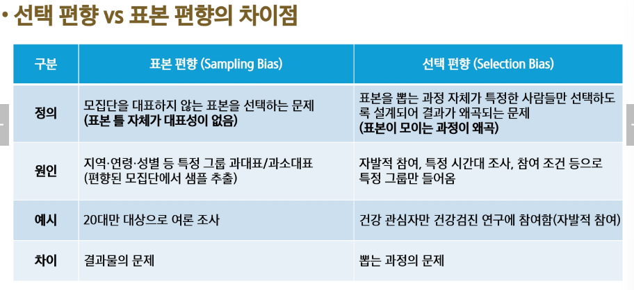

# 임의 추출(무작위 추출)의 개념
- 모집단에서 특정한 규칙 없이 무작위로 표본을 선택하는 방법
- 표본추출의 종류
    - 복원 추출
    - 비복원 추출
## 임의 추출이 필요한 이유
1. 공정성 유지 : 모든 대상이 동일한 확률로 선택될 기회 제공
2. 대표성 확보 : 특정 그룹에 치우치지 않고 모집단 전체를 반영
3. 편향 방지 : 의도적인 선택(예:특정 지역, 특정 연령대만 조사)을 막아 객관적인 데이터 확보
4. 통계 분석의 신뢰도 증가 : 모집단을 잘 반영한 표본이면, 정확한 결론을 도출할 가능성이 높아짐

# 표본 편향의 개념
- 모집단을 대표하지 못하는 잘못된 표본을 선택하여 조사 결과가 왜곡된 현상
    - 대표성을 담보하는 방법은 여러가지 있지만, 핵심은 임의 표본 추출

# 표본 편향을 줄이는 방법1
- 임의 추출 강화
    - 무작위로 표본을 선택하여 공정성을 높이는 방법
    - 모든 개체가 동일한 확률로 선택될 기회를 가져야 함
- 예시 : 대통령 지지율 조사
    - 전국에서 유권자를 무작위로 선택
    - 특정 나이대, 지역을 대상으로만 조사하면 편향 발생
- 장/단점
    - 장점 : 모집단을 공정하게 대표할 가능성 증가
    - 단점 : 모집단이 크면 랜덤으로 뽑기 어려움
- 방법
    - 제비 뽑기
    - 난수 생성기 활용

# 표본 편향을 줄이는 방법2
- 층화 추출 활용
    - 모집단을 그룹(층)으로 나눈 후 , 각 층에서 무작위로 표본을 추출
    - 모집단 내 특정 특성(성별, 연령, 지역, 직업등)에 따라 그룹을 나눈 후, 각 그룹에서 무작위로 표본을 추출
- 예시 : 선거 여론 조사
    - 유권자를 성별, 나이대, 지역별로 나눈 후, 각 그룹에서 비율에 맞게 표본을 추출
- 장/단점
    - 장점 : 모집단의 다양한 특성을 고려 가능하며, 과소/과대 대표되는 문제를 방지
    - 단점 : 모집단을 층화하는 과정이 시간과 비용이 소요
- 방법
    - 모집단을 비슷한 특성으로 가진 그룹으로 나눔
    - 각 그룹에서 비율에 맞게 표본 추출

# 표본 편향을 줄이는 방법3
- 계통 추출 적용
    - 일정한 간격으로 표본을 추출하는 방법
- 예시 : 공장 품질 검사
    - 생산된 1000개의 제품 중 처음 제품을 무작위로 선택한 후, 이후 매 100번째 제품마다 품질 검사를 진행
- 장/단점
    - 장점 : 쉽고 빠르게 표본 추출이 가능하다
    - 단점 : 모집단의 특정 패턴이 있다면, 편향 발생 가능
- 방법
    - 모집단 크기 : N, 표본 크기 : n  k(간격) = N / n
    - 첫 번째 표본을 무작위 선택
    - 이후 k 간격마다 표본 선택

# 표본 편향을 줄이는 방법4
- 표본 크기 확대
    - 표본 크기를 늘려 모집단을 더 정확히 반영
- 예시 : 대선 여론 조사
    - 표본이 500명 일 때보다 5000명일 때 더 정확한 결과 예측 가능
- 장/단점
    - 장점 : 표본이 클수록 결과의 신뢰도 증가
    - 단점 : 표본이 너무 크면, 비용과 시간이 많이 소요
- 방법
    - 가능하면 더 많은 표본을 확보
    - 비용과 시간을 고려하여 적절한 표본 크기 선정

# 표본 편향을 줄이는 방법5
- 편향을 보정하는 가중치 적용
    - 특정 그룹이 과소/과대 대표된 경우, 보정하는 방법
- 예시 : 대선 여론 조사
    - 만약 여론 조사에서 20대 남성의 표본이 부족하다면, 결과 해석 시, 20대 남성의 응답 비율을 더 높게 반영
- 장/단점
    - 장점 : 모집단을 더 정확하게 반영 가능
    - 단점 : 가중치가 잘못 설정되면 오히려 결과 왜곡될 가능성 발생
- 방법
    - 부족한 그룹의 응답을 보정하기 위해 가중치를 적용해 결과 반영

# 표본조사의 오류
- 표본오차(Sampling Error)
    - 표본을 뽑는 과정에서 우연히 생기는 차이
    - 같은 방법으로 뽑아도 표본마다 값이 조금씩 달라짐
    - 예 : 표본평균이 49kg, 51kg, 50kg처럼 계손 흔들리는 현상 -> 표본 크기를 키우면 줄어듦
    - 자연적인 흔들림이어서 개선이 되지만 없앨 수는 없음
- 비표본오차(Non-Sampling Error)
    - 조사 절차(설계) 자체의 문제로 생기는 체계적 오류(=편향)
    - 표본의 틀 자체의 오류, 응답하지 않음, 응답 왜곡, 특정 집단만 포함되는 문제
    - 예 : 전화 설문 -> 집전화 없는 사람 자동 배제 -> 표본 크기를 키워도 절대 해결되지 않음
    - 시작부터 실패한 구조적 편향이라 표본을 아무리 많이 뽑아도 해결되지 않음

