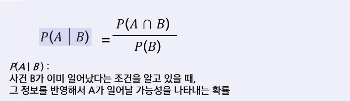
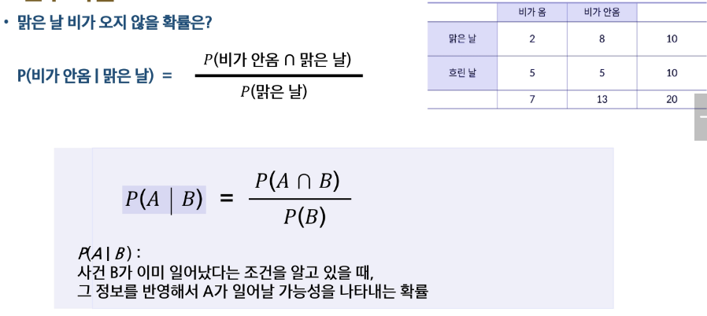
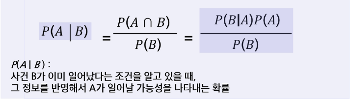
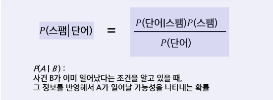

# 조건부 확률
- 조건부 확률은 어떤 정보(B)가 주어졌을 때, 그 조건 아래에서 다른 사건(A)이 일어날 확률을 의미
- B가 일어났다는 사실을 알고 있을 때, A가 일어날 가능성은 얼마나 되는가를 계산하는 개념

- 예시

- 그런데 B가 일어나는 확률을 모른다면?
- B를 직접 구하기 어렵기 때문에, A와 B의 관계를 뒤집어 계산할 수 있는 구조를 필요 -> 베이즈 정리
    - 현실에서는 P(B)(사전확률), P(A | B)(우리가 모델링하기 쉬운 조건부)만 알 수 있는 경우가 많음
    - 따라서 뒤집어진 확률인 P(B | A)를 계산하려면 베이즈 공식이 필수
- 예) 추천 시스템 - 사용자의 행동으로부터 취향 추론
    - A : 사용자가 어떤 영화를 클릭했다
    - B : 사용자가 실제로 종아하는 장르 P(행동(A) | 취향(B)) 은 모델링 쉬움
    - -> 행동 로그 기반 하지만 원하는 건 P(취향(B) | 행동(A))

# 베이즈 정리
- 직접 구하기 어려운 P(A|B)를, 더 구하기 쉬운 P(B|A), P(A), P(B)로 계산 할 수 있게 해주는 공식
- 즉, 베이즈 정리는 조건부 확률의 방향을 뒤집어 주는 역할
- 데이터 분석 및 머신러닝에서 자주 쓰이는 개념
- 현실에서 측정 가능한 확률 : A -> B 우리가 알고 싶은 확률 : B -> A

- 스팸 메일 판단 예시
    - 스팸 메일과 정상 메일에서 특정 단어가 등장하는 비율을 관찰
    - 하지만 우리가 실제로 알고 싶은 것은 메일에 단어가 보였을 때, 그 메일이 스팸일 확률이라고 생각
    - 이 값은 직접 관찰할 수 없기 때문에, 관찰 가능한 확률(뒤집힌 방향)을 이용해 계산해야 함
    - 스팸 비율 - P(스팸)
    - 단어가 등장할 전체 확률 - P(단어)
    - 따라서 베이즈 정리를 사용하여 우리가 원하는 확률을 계산할 수 있음
    
