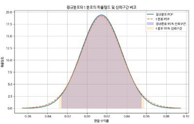

# 스튜던트의 t분포
- 정규분포는 모집단의 분포가 정규일 때 사용 가능하고, 표본평균의 분포도 CLT로 인해 정규에 가까움
- 현실에서는 σ(모집단의 표준편차)를 모름
- 그래서 σ 대신 s(표본 표준편차)를 넣으면 -> 분포의 꼬리가 두꺼워짐 -> 이걸 반영한 분포가 t-분포
- 왜 두꺼워지는가? -> 고정된 σ가 아니라 표본마다 변화하는 s라서 더 멀리 떨어진 값이 나올 가능성이 생김
- t분포는 정규분포와 유사하지만 꼬리 부분이 더 두꺼운 확률분포
- 특징 :
    - 표본의 개수(표본의 크기)가 작거나 모집단의 표준 편차를 정확히 모를 때 자주 사용
    - 꼬리가 더 두꺼움 -> 정규분포보다 극단값이 나타날 가능성을 더 현실적으로 반영함
    - 자유도 개념
        - -> 자유도란, 간단히 말해 데이터를 가지고 얼마나 자유롭게 움직일 수 있는지를 나타내는 수
        - -> 자유도가 작을수록 꼬리가 두꺼워지고, 자유도가 커질수록 정규분포와 비슷
- 가상 금융 데이터를 통한 비교 시각화
    - 주황색 (t분포)의 신뢰 구간이 파란색(정규분포)의 신뢰구간보다 조금 더 넓음
    - 금융 데이터는 극단적인 수익률이 자주 나타나므로, t분포를 활용한 분석이 더 적합하고 안전함
    - 이를 통해 t분포는 작은 표본을 이용할 때 더 넓고 현실적인 신뢰구간 제공
    
