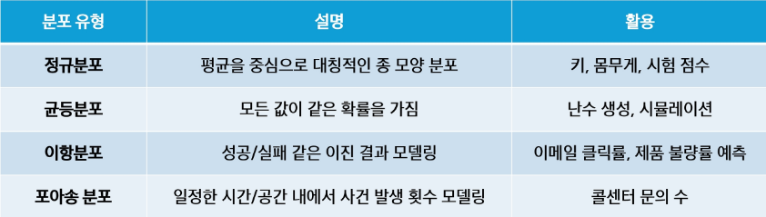

# 표본분포
- 모집단에서 표본을 여러 번 뽑아서, 그때그때 계산한 "평균,비율" 같은 통계량이 만드는 분포
- 같은 모집단에서 동일한 크기 n의 표본을 많이 추출 했을 때, 어떤 통계량이 만들어내는 확률 분포
- 표본이 얼마나 흔들리는지(불확실성)를 설명
- 특징 :
    - 단일 표본 하나만 봤을 때는 샘플 경균이 모집단의 평균에 가까울 수도 아닐 수도 있음
    - 많은 표본 평균을 모으면 특정한 패턴을 띠게 됨
- 예시 : 
    - 전국 고등학생의 평균 키를 알고 싶다면, 모든 학생의 키를 조사해야 함 -> 시간과 비용 많이 소모
    - 랜덤하게 한 명 씩 뽑아서 평균을 구하는 것을 여러 번 반복하여 평균값들이 따르는 분포가 만들어지게 함

# 대표적인 분포의 종류
- 분포 = 데이터가 어떻게 생겼는지 보는 것
- 이 분포들은 모집단 데이터에도 적용될 수 있고 표본 평균, 표본 비율 같은 표본통계량에도 적용될 수 있음
