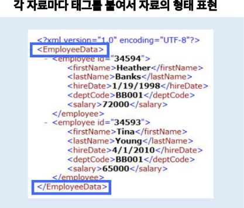
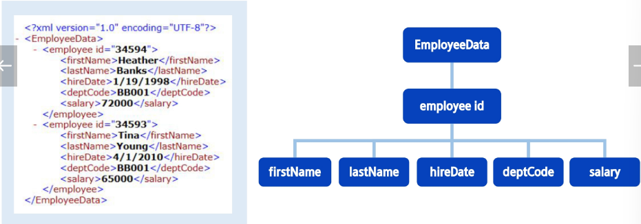
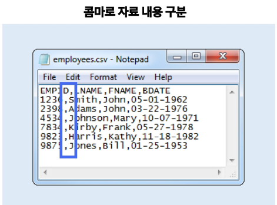
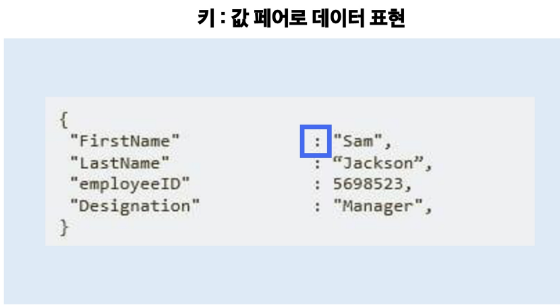
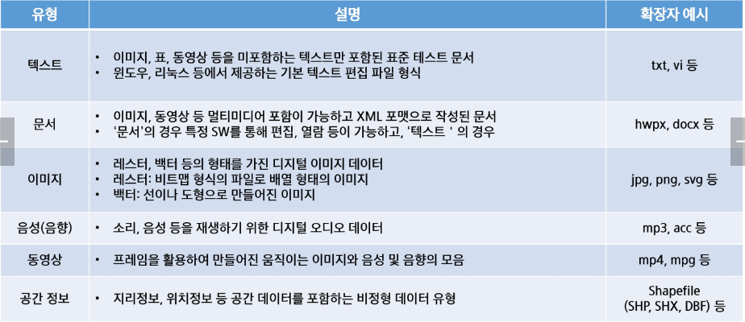

# OpenAPI
- OPENAPI(Open Application Programming interface)는 누구나 사용할 수 있도록 공개된 API를 말하며, 웹 사이트가 가진 기능을 모두가 이용할 수 있도록 공개한 프로그래밍 인터페이스
- 네이버 지도, 구글 맵, 공공데이터 포털 등이 대표적인 예
- 많은 서비스 업체 및 공공 기관에서 제공하는 서비스를 외부에서 사용할 수 있게 API를 제공하는 형태
- 대부분 OPENAPI 서비스는 프로토콜의 GET, POST 등의 메서드를 사용해 자원이나 서비스를 요청
- 일반적인 웹 페이지에 GET 요청을 보내면 HTML 문서를 응답해주지만, OpenAPI에 GET요청을 보내면 데이터를 정해진 형식의 텍스트로 응답해줌

# 공개된 OpenAPI 사용하기
- 만약 기관 등의 서버에서 Open API를 제공하고 있다면, 손쉽게 정제된 형태의 데이터를 가져올 수 있음
- 주로 XML이나 JSON이라는 데이터 형식으로 인코딩
    - XML : 각 자료마다 태그를 붙여서 자료의 형태 표현, 트리 형태구조
        - 
        - 
    - CSV : 콤마로 자료 내용 구분
        - 
    - JSON : 키 : 값 페어로 데이터 표현
        - 

# Request
- OPENAPI(Open Application Programming Interface)는 누구나 사용할 수 있도록 공개된 API를 말하며, 웹 사이트가 가진 기능을 모두가 이용할 수 있도록 공개한 프로그래밍 인터페이스
- 네이버 지도, 구글 맵 대표적인 예
- 많은 서비스 업체 및 공공 기관에서 제공하는 서비스를 외부에서 사용할 수 있게 API를 제공하는 형태

# HTTP 통신
- 웹 브라우저와 웹 서버 사이에 데이터를 주고 받는데 사용되는 통신

## Requests 라이브러리
- 접근할 웹 페이지의 데이터를 요청/응답 받기 위한 라이브러리

## GET 메소드와 URL
- GET 메소드 :
    - 웹 서버에게 파라미터를 포함해 요청을 보내는 가장 쉬운 방법, URL에 파라미터 정보를 담아서 보내는 것
    - 사용자가 서버에게 웹 페이지를 보여 달라고 하는 것을 요청이라 하고, 서버가 요청에 대한 대답을 담아 HTML 문서로 주는 것을 응답

# OpenAPI의 데이터 제공 유형
- 