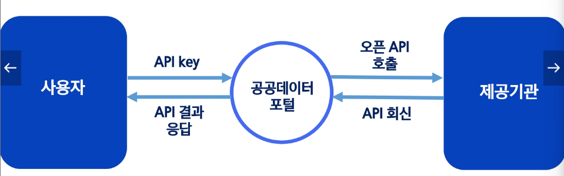

# 공공 데이터 포털의 OpenAPI 사용 절차
- 

# 공공 데이터 포털의 OpenAPI 활용
1. 먼저 공공데이터 포탈 접속
2. 검색창에 관심 주제 검색 혹은 인기검색어
3. 분류에서ㅓ 파일데이터는 다운로드 가능한 과거 데이터, 오픈API는 실시간 상황이 반영되는 API를 의미 , 오픈API 중 원하는 주제 선택
4. 적절히 활용 목적 쓰고, 동의 후 활용신청 버튼 누른다. (검토단계 없음)
5. 이후 마이페이지 > 오픈API > 인증키발급현황에서 인증키 확인
6. 다시 해당 OpenAPI의 상세페이지로 돌아가면, 요청변수에 무엇을 입력해야하는지 설명. 필수항목은 반드시 입력, 옵션 항목은 GET에 포함 안시켜도 됨. 