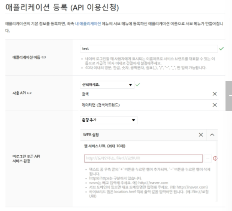

# 기업 OpenAPI 활용
- 공공데이터는 정형,정적 데이터 위주
- 기업 API는 실시간 / 서비스 중심 데이터 등을 다양하게 제공
- 다양한 기업에서 OPENAPI를 제공
- Naver OpenAPI뿐만 아니라 다양한 기업의 API를 통해 데이터를 불러올 수 있음
- 무료, 유료 모두 존재
- 단순히 데이터 수집 뿐만 아니라 다양한 기능을 제공

# Naver OpenAPI 활용
1. 실습용이면 아무 의미 없는 값을 넣어도 가능
2. 네이버 Open API
    - 비로그인(Open API) 서비스 설정 화면
3. 웹 서비스 URL 의미
    - 네이버 로그인(OAuth)을 사용하는 서비스 주소
4. 그냥 API 호출만 하는 경우는 의미가 없음
5. 이 칸이 실제로 쓰이는 경우
    - 네이버 로그인 API 사용
    - OAuth 인증 흐름 사용
    - 로그인 성공 후 redirect 되는 URL이 필요할 때

# 로그인 기반 API와 비로그인 API
- 로그인 방식의 OpenAPI (OAuth 기반)
    - 네이버 로그인 인증 필요(OAuth)
    - 사용자 권한을 위임받아 기능 수행하는 것이 주 목적
- 비로그인 방식 OpenAPI (API Key 기반)
    - Client ID / Client Secret으로 인증
    - 사용자 로그인 불필요
    - 데이터 조회 중심

