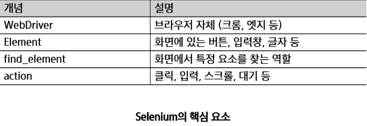
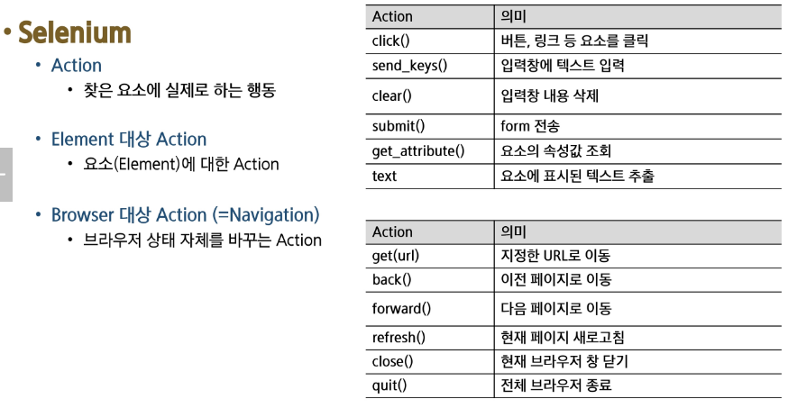
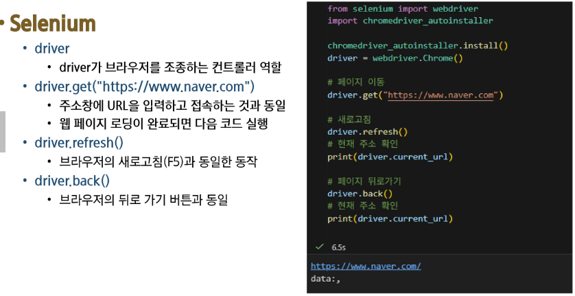
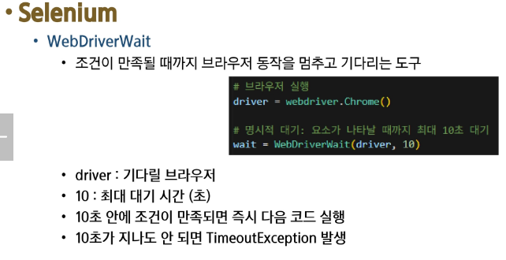
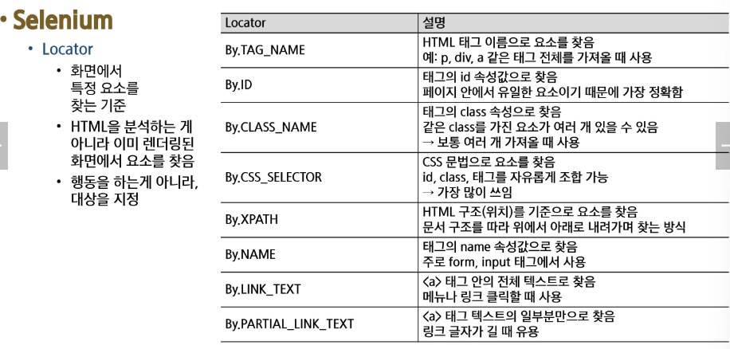
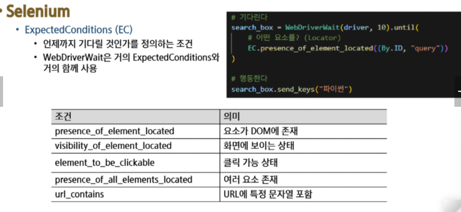
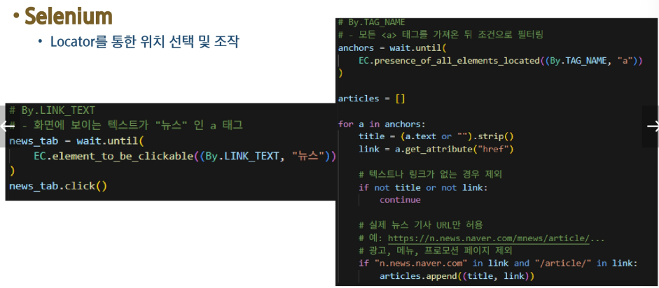

# Selenium
- Selenium은 웹을 파싱하는 도구가 아니라 브라우저를 조종하는 도구
- 정적 페이지를 크롤링하는 경우는 HTML을 받아서 분석하는 방식
- 실제 서비스들은 대부분 자바스크립트로 화면을 그리는 형태
- 크롤링 관점에서 HTML을 가져오는 것으로는 한계가 있어 브라우저를 직접 조작해서 데이터를 가져옴
- 웹 데이터를 수집하는 것 뿐만 아니라 반복작업 자동화 및 웹 어플리케이션 테스트를 용이하게 가능
    - 주소창에 URL 입력
    - 뒤로 가기 / 새로고침
    - 버튼 클릭
    - 입력창에 텍스트 입력
    - 화면 스크롤
    - 화면 캡처

# Selenium이 필요한 이유
- BeautifulSoup은 결국 HTML을 가져와서 파싱하는 역할일 뿐
- Selenium의 핵심은 결국 웹 브라우저를 컨트롤할 수 있다는 것
- 브라우저를 코드로 제어
- 화면에서 보이는 내용이라면 모두 컨트롤할 수 있음

# Selenium
- 브라우저를 조작하기 위한 여러 역할의 도구들이 모여 있는 프레임워크
- 조작을 가능하게 만드는 핵심
    - 요소(Element)를 정확히 찾고 적절한 타이밍에 행동(Action)을 주는 것

