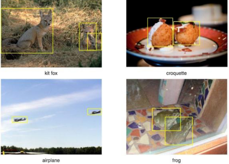

# 머신러닝
- Tom Mitchell (1998) : 컴퓨터 프로그램이 어떤 작업 집합 T와 성능 척도 P에 대해 경험 E로부터 학습한다고 할 때, 경험 E를 통해 T 작업에 대한 성능이 P로 측정한 결과 향상되는 경우를 말한다
- 경험(E) : 데이터, 과거의 사례
- 작업(T) : 해결하려는 문제, 과제
- 성능 척도(P) : 얼마나 잘했는지 평가 기준

- 머신러닝은 데이터(E)를 통해 과제(T)를 더 잘 수행하도록, 성능(P)이 향상되는 과정

# 피처 엔지니어링이란
- 모델이 더 좋은 예측을 할 수 있도록 데이터를 가공하는 과정
- 데이터를 단순히 수집하는 것보다 적절한 피처(Feature, 변수)를 만드는 것이 성능 향상에 중요

# 피처 엔지니어링 필요성
- 원본 데이터는 모델이 바로 이해하기 어려운 형태일 수 있음
- 좋은 피처를 만들면 복잡한 모델 없이도 높은 성능을 낼 수 있음
- 불필요한 변수를 제거하면 연산 속도가 빨라지고 해석력이 향상됨

# 피처 선택(Feature Selection)
- 모델 성능에 중요한 변수만 선택하고 불필요한 변수 제거
- 방법 :
    - 상관계수 분석 -> 상관관계가 높은 변수 제거
    - 분산 기반 선택 -> 변화가 거의 없는 변수 제거
    - Recursive Feature Elimination(REF) -> 모델 성능에 가장 중요한 변수 선택

# 피처 생성(Feature Creation)
- 기존 데이터를 활용하여 새로운 변수를 만드는 과정
- 예시 :
    - 날짜 데이터 -> "요일", "주말 여부", "계절" 변수 추가
    - 판매 데이터 -> "가격" X "판매량"으로 매출 변수 생성

# 피처 변환(Feature Transformation)
- 모델이 데이터를 더 잘 학습할 수 있도록 변형
- 방법 :
    - 정규화(Normalization) : 값의 범위를 [0,1]로 조정
    - 표준화(Standardization) : 평균 0, 표준편차 1로 조정
    - 로그변환(Log Transformation) : 데이터 분포를 정규분포에 가깝게 변형

# 범주형 데이터 인코딩(Categorical Encoding)
- 문자 데이터를 숫자로 변환하여 모델이 이해할 수 있도록 함
- 방법 : 
    - 원-핫 인코딩(One-Hot Encoding) : 카테고리를 0과 1로 변환
    - 라벨 인코딩(Label Encoding) : 카테고리를 숫자로 변환(예: "Red" -> 1, "Blue" -> 2)

# 결측값 처리(Handling Missing Values)
- 데이터에서 비어있는 값(결측치)을 처리하는 과정
- 방법 :
    - 삭제 : 결측치가 적으면 해당 행 제거
    - 대체 : 평균, 중앙값, 최빈값으로 채우기
    - 예측 모델 사용 : 머신러닝을 활용하여 결측값 예측

# 이상치 처리(Outlier Handling)
- 극단적인 값을 감지하고 처리하는 과정
- 방법 :
    - Z-score, IQR(사분위 범위) 기반 이상치 제거
    - 로그 변환으로 이상치 영향을 줄이기

# 머신러닝의 분류
- Supervised Learning(지도 학습)
- Unsupervised Learning(비지도 학습)
- Reinforcement Learning(강화 학습)

## Supervised Learning(지도 학습)
- 정답을 주고 학습 시킴

## 컴퓨터 비전에서의 Supervised Learning(지도학습)
- 객체 위치 지정 및 탐지
    - x = raw pixeld of the Image, y = the bounding boxes
    

## 자연어 처리에서의 Supervised Learning(지도학습)
- 기계 번역

## Unsupervised Learning(비지도 학습)
- 데이터셋에 라벨이 없음 : x1, ... , xn
- 목표(모호하게 제시됨) : 데이터에서 흥미로운 구조를 발견하는 것

## Self-Supervised Learning 자기지도학습
- Large Language Model
    - 대규모 언어 데이터셋을 통해 학습된 기계 학습 모델
    - 다양한 목적으로 활용 가능
- 자기 지도 학습
    - 지도 학습의 단점인 정답 데이터에 대한 한계를 극복 - 정답이 없는 데이터도 자체 데이터로 학습
    - 사전 학습(Pre-training)과 미세 조정(Fine-tuning)단계로 진행

# Reinforcement Learning(강화 학습)
- 순차적인 결정을 내리는 학습
    - 알고리즘은 데이터를 상호작용적으로 수집할 수 있음

