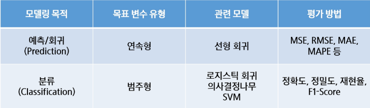
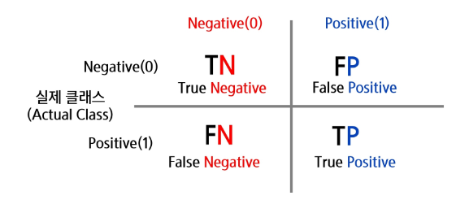
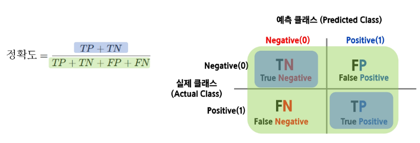
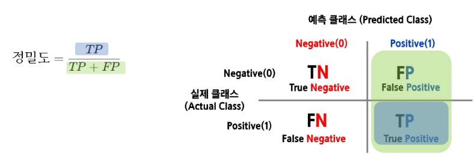
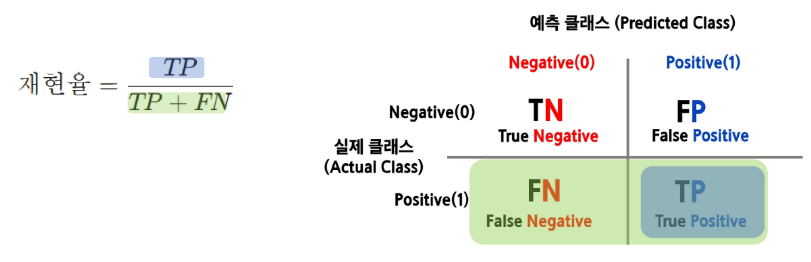
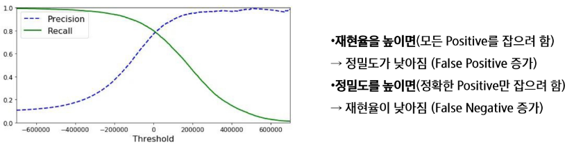
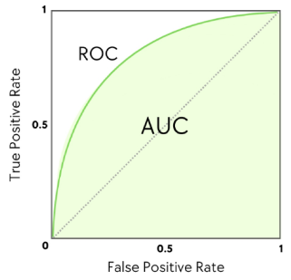

# Overfitting vs Underfitting
- Overfitting(과적합)
    - 모델이 학습 데이터에 지나치게 적합하여, 복잡한 패턴까지 모두 학습
    - 학습 데이터에서는 높은 성능, 하지만 새로운 데이터에서는 성능이 저하
- Underfitting(과소적합)
    - 모델이 충분히 학습되지 않아 중요한 패턴조차 학습하지 못함
    - 학습 데이터와 테스트 데이터 모두에서 성능 저조

# 평가(Evaluation)
- 실제값과 모델에 의해 예측된 값을 비교하여 두 값의 차이(오차)를 구하는 것
- (실제 값 - 예측값) = 0 이면, 오차가 없는 것으로 모델이 100% 성능을 보임
- But 성능이 100%인 모델은 현실적으로 힘들기 때문에, 오차를 구하여 어느 정도까지 오차를 허용할지 결정
- -> 과적합(Overfitting)을 방지하고 최적의 모델을 찾기 위해 실시

- 모델링의 목적 또는 목표 변수의 유형에 따라 다른 평가지표 사용

# 회귀 모델 평가 방법
- 하나의 목표를 가지고 다양한 회귀 모델을 만들어 테스트
- 그 중 어떤 모델이 가장 나은 모델인지 판단할 때 모델 평가지표 사용
- 실제 데이터와 예측 결과 데이터가 얼마나 비슷한지에 기반하지만, 단순하게 이것만 가지고 판단하기에는 무리가 있음
    - 평균 절대 오차(MAE, Mean Absolute Error)
    - 평균 절대 백분율 오차(MAPE, Mean Absolute Percentage Error)
    - 평균 제곱 오차(MSE, Mean Squared Error)
    - 평균 제곱근 오차(RMSE, Root Mean Squared Error)
    - 결정 계수(r^2 Scire)

## MAE(Mean Absolute Error)
- 실제 정답 값과 예측 값의 차이를 절대값으로 변환한 뒤 합산하여 평균을 구함
- 이상치를 고려하지 않는 경우에 주로 사용
- 값이 낮을수록 좋은 모델
- 실제 정답보다 낮게 예측했는지, 높게 했는지를 파악이 어려움
- 스케일에 의존적이기 때문에 모델마다 여러 크기가 동일해도 에러율은 동일하지 않음

# MAPE(Mean Absolute Percentage Error)
- MAE를 상대적 오차로 변환하여 데이터의 스케일에 영향을 덜 받도록 함
- 이상치를 고려하지 않는 경우에 주로 사용
- 값이 낮을수록 좋은 모델
- 실제 정답보다 낮게 예측했는지, 높게 했는지를 파악이 어려움
- 실제 정답이 0에 가까운 경우, 값이 발산할 수 있으므로 주의

# MSE(Mean Squared Error)
- 실제 정답 값과 예측 값의 차이를 제곱한 뒤 평균을 구함
- 시계열 데이터에서, 미분이 연속적이어야 할 때 주로 사용
- 값이 낮을수록 좋은 모델
- 이상치(outlier)에 매우 민감(큰 오차에 큰 패널티)
- 데이터에 이상치가 많다면 MSE 대신 MAE를 고려
- 스케일 의존적이므로 모델 비교 시 주의 필요

# RMSE(Root Mean Squared Error)
- MSE에 루트를 씌워서 에러를 제곱해서 생기는 값의 왜곡을 줄임
- 시계열 데이터에서, 미분이 연속적인 순간이 필요할 때 주로 사용
- 값이 낮을수록 좋은 모델
- 이상치에 대한 패널티가 여전히 존재 (MSE보다는 덜 민감)(데이터의 크기가 다르면 RMSE 값도 다르게 나와서 서로 다른 스케일의 모델을 비교하기 어려움)
- 데이터에 이상치가 많다면 MSE 대신 MAE(Mean Absolute Error)계열 사용

# R2 score = R squared
- 모델이 실제 데이터의 변동성을 얼마나 잘 설명하는지를 나타내는 지표
- 실제 값의 전체 변동성(SST) 중에서 모델이 설명할 수 있는 비율
- 1에 가까울 수록 좋은 모델

# 분류 모델 평가 방법
- 하나의 목표를 가지고 다양한 분류 모델을 만들어 테스트
- 그 중 어떤 모델이 가장 나은 모델인지 판단할 때 모델 평가지표 사용
- 회귀모형과 비슷하게 실제 데이터와 예측 결과 데이터가 얼마나 비슷한 지에 기반하지만, 단순하게 이것만 가지고 판단하기에는 무리가 있음
    - 정확도(Accuracy)
    - 오차행렬(Confusion Matrix)
    - 정밀도(Precision)
    - 재현율(Recall)
    - F1-스코어
    - ROC AUC

# 오차행렬(Confusion Matrix)
- 분류 모델이 예측한 결과와 실제 정답을 비교하여 성능을 평가하는 방법
- 특히 이진 분류(binary classification)문제에서 모델이 얼마나 정확하게 예측했는지를 분석하는데 유용

- TP (True Positive)
    - 실제로 참인 데이터를 모델이 참으로 예측한 경우
- TN (True Negative)
    - 실제로 거짓인 데이터를 모델이 거짓으로 예측한 경우
- FP (False Positive)
    - 실제로 거짓인데 모델이 참으로 예측한 경우
- FN (False Negative)
    - 실제로 참인데 모델이 거짓으로 예측한 경우

# 정확도(Accuracy)
- 전체 샘플 중에서 모델이 맞춘 비율
- 하지만 데이터가 불균형한 경우에는 부적절할 수 있음(예: 99% 건강한 데이터, 1% 암 환자)

# 정밀도(precision)
- 모델이 "참(Positive)"이라고 예측한 것 중 실제로 참인 비율
- FP(거짓을 참으로 예측하는 경우)를 줄이는데 초점
- 예: 스팸 필터에서 중요(스팸 아닌 메일을 스팸으로 분류하면 안 됨)

# 재현율(Recall)
- 실제 참(Positive) 중에서 모델이 맞춘 비율
- FN(참을 거짓으로 예측하는 경우)을 줄이는데 초점
- 예 : 암 진단 모델에서 중요(암 환자를 놓치면 안 됨)

# Precision과 Recall의 Trade off
- 재현율(Recall)이 중요한 경우 -> 실제 Positive(양성)를 놓치면 안 되는 상황
    - 암 진단 : 암 환자를 놓치면 치명적
    - 금융 사기 탐지 : 사기 거래를 놓치면 피해 발생
- 정밀도(Precision)이 중요한 경우 -> 실제 Negative(음성)를 잘못 positive(양성)으로 예측하면 문제가 되는 상황
    - 스팸 필터 : 중요한 이메일을 스팸으로 분류하면 안 됨
    - 의료 검사 : 불필요한 추가 검사(비용증가)

# Precision과 Recall의 Trade off
- 정밀도와 재현율은 반비례 관계
- 임계값(Threshold)을 조정하면 정밀도(Precision) 또는 재현율(Recall)을 조절할 수 있음
- 하지만 정밀도를 높이면 재현율이 낮아지고, 재현율을 높이면 정밀도가 낮아지는 관계

# 정밀도를 100%로 만드는 방법
- 확실한 경우만 positive로 예측하고 나머지는 모두 Negative로 예측
- 예 : 1000명 중 단 1명만 확실한 양성이라 판단하고 나머지는 모두 음성으로 처리
- 결과 : FP(거짓 양성) = 0 -> 정밀도 100%
- 문제 : 대부분의 양성을 놓칠 위험(재현율이 극도로 낮아짐)

# 재현율을 100%로 만드는 방법
- 모든 데이터를 Positive(양성)으로 예측
- 예 : 1000명 모두 양성이라 가정하면 실제 양성 30명은 모두 검출됨
- 결과 : FN(거짓 음성) = 0 -> 재현율 100%
- 문제 : 너무 많은 FP(거짓 양성) 발생 -> 정밀도 급락

-> 정밀도와 재현율을 극단적으로 높이면 성능이 왜곡됨
-> 업무에 따라 적절한 균형이 필요(F1-score 활용)

# F1-score
- 정밀도와 재현율의 조화 평균

- 데이터가 불균형할 때 유용
- 정밀도와 재현율 사이에서 균형을 맞춘 지표
- 정밀도와 재현율이 어느 한쪽으로 치우치지 않는 수치를 나타낼 때 높은 값을 가짐

# ROC 곡선(Receiver Operating Characteristic Curve)
- False Positive Rate(FPR) 변화에 따른 True Positive Rate(TPR) 변화를 나타내는 그래프
- X축 : False Positive Rate(FPR, 잘못 양성으로 예측한 비율)
- Y축 : True Positive Rate(TPR, 실제 양성을 맞춘 비율)
- 곡선이 왼쪽 위로 올라갈수록 좋은 모델

# AUC(Area Under Curve)
- ROC 곡선 아래 면적을 의미하며 1에 가까울수록 좋은 성능
- 일반적으로 의학 및 머신러닝의 이진 분류 평가 지표로 활용됨

# ROC 곡선과 AUC
- TPR(True Positive Rate, 재현율)
    - 실제 양성(Positive) 중에서 모델이 맞게 예측한 비율
    - 공식 : TPR = TP / (TP + FN)
    - 값이 클수록 좋은 모델(양성을 잘 찾아냄)
- FPR(False Positive Rate)
    - 실제 음성(Negative) 중에서 모델이 잘못 예측한 비율
    - 공식 : FPR = FP / (FP + TN)
    - 값이 작을수록 좋은 모델(불필요한 오탐을 줄임)
- ROC 곡선의 의미
    - X축 : FPR(False Positive Rate)
    - Y축 : TPR(Treu Positive Rate)
    - 곡선이 왼쪽 위로 갈수록 좋은 모델
    - 임계값(Threshold)에 따라 FPR과 TPR이 변화
- 결론 :
    - 좋은 모델일수록 ROC 곡선이 좌상단에 위치
    - AUC(ROC 아래 면적)가 1에 가까울수록 성능이 우수함

