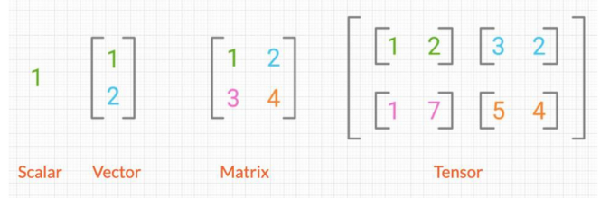

# 벡터의 정의
- 벡터는 선형대수학의 기본 요소로, 크기와 방향을 가짐
- 좌표 평면에서 점을 나타낼 때 (x,y)와 같은 형태로 표현
- 벡터는 머신러닝과 데이터 분석 등에서 데이터를 표현하는 기본 단위로 사용
- 파이썬에서는 숫자로 이루어진 배열(리스트)형태로 표현

# 벡터의 좌표
- 벡터는 좌표로 표현되며, 두 숫자가 원점에서의 이동을 나타냄
- 첫 번째 숫자는 x축 방향 이동, 두 번째 숫자는 y축 방향 이동
- 3차원에서는 z축이 추가됨

# 데이터를 표현하는 방법
- 스칼라 : 하나의 숫자(0차원)
- 벡터 : 여러 개의 숫자가 나열된 1차원 배열
- 행렬 : 숫자의 행과 열로 구성된 2차원 배열
- 텐서 : 3차원 이상을 포함하는 행렬보다 높은 다차원 배열

# 텐서의 활용
- 텐서는 공간을 수치적으로 표현하는 도구
- 데이터 분석에서는 벡터를 사용하여 여러 특성을 표현함
- 벡터를 이용해 공간 내 객체를 표현하고 조작하는데 활용
- 텐서를 활용하여 딥러닝, 머신러닝에 적용하여 데이터를 표현함
- 이를 활용해 복잡한 데이터와 패턴을 학습하고 분석하는데 사용

