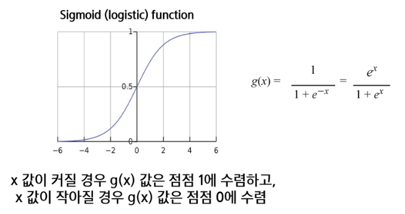

# 로지스틱 회귀
- 이진 분류를 위한 대표적인 선형 모델
- 입력 데이터를 기반으로 특정 클래스에 속할 확률을 예측
- 회귀라는 이름이 붙었지만 분류 문제에 사용
- S자형 곡선을 가지는 함수

# 로지스틱 함수(Sigmoid 함수)
- 예측 값을 0과 1사이의 확률로 변환하는 함수

# 장점
- 해석이 간단하고 계산이 빠름
- 데이터가 선형적으로 분리될 수 있는 경우 좋은 성능

# 단점
- 비선형 데이터에는 적합하지 않을 수 있음
- 복잡한 결정 경계를 만들기 어려움

