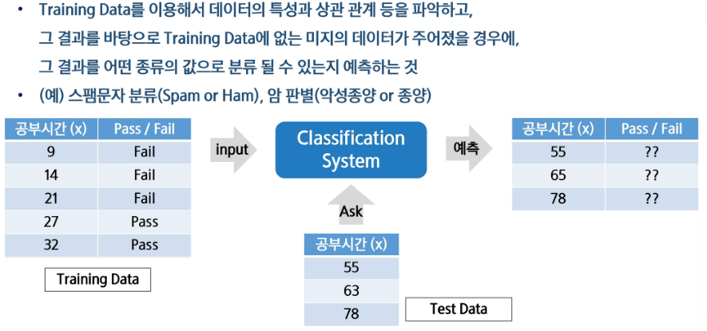

# 분류(Classification)란 무엇
- 분류의 정의
    - 분류는 입력 데이터가 여러 개의 카테고리 중 하나에 속하도록 지정하는 작업
    - 주로 지도학습 방식으로 이루어지며, 데이터의 특징을 기반으로 해당 데이터가 어느 범주에 속하는지를 예측
- 분류 문제의 목표
    - 학습 알고리즘은 함수 f을 생성하여 입력 벡터 x가 어떤 카테고리 y에 속하는지를 예측
    - 예를 들어, 이미지 인식에서 입력은 이미지의 픽셀 값으로 이루어지고, 출력은 이미지에 포함된 객체를 나타내는 카테고리 번호
- 분류 문제의 예시
    - 객체 인식 : 이미지 속 사물(예 : 음료수 종류)을 인식하여 해당 사물이 무엇인지 분류하는 작업
    - 얼굴 인식 : 사진 속 인물을 인식하고 자동으로 태그하는 기술로, 사용자와 컴퓨터 간의 자연스러운 상호작용을 가능하게 함

# 분류와 회귀의 차이
- 분류
    - 정의 : 데이터를 미리 정의된 카테고리(범주)로 분류하는 작업
    - 출력값 : 이산적인 값(카테고리 또는 레이블)
    - 에시 : 이메일이 스팸인지 아닌지 구분, 암 진단 여부(양성/음성) 분류, 이미지 속 개체 인식
- 회귀(Regression)
    - 정의 : 연속적인 숫자 값을 예측하는 작업
    - 출력 값 : 연속적인 실수 값
    - 예시 : 주택 가격 예측, 온도 변화 예측, 주식 시장 가격 예측
- 핵심 차이점
    - 분류는 결과가 '카테고리'로 나타나며, 이산적인 값으로 분류
    - 회귀는 결과가 '숫자'로 나타나며, 연속적인 값을 예측

# 분류

# 분류 문제의 입력과 출력
- 입력 데이터(Features, 입력 변수)
    - 분류 문제에서 입력 데이터는 하나 이상의 특징(Feature)으로 이루어진 벡터로 표현
    - 특징 벡터
        - 예시 : 이미지 인식에서 이미지의 각 픽셀 값이 특징이 될 수 있음
        - 입력 데이터는 연속형(숫자) 또는 이상형(범주형) 값으로 구성될 수 있음
- 출력 데이터(Labels, 출력 변수)
    - 분류 문제의 출력은 데이터가 속한 클래스(범주)를 나타냄
    - 출력 레이블 : y
        - 예시 : 이진 분류에서 출력은 0(음성) 또는 1(양성)
        - 다중 클래스 분류에서는 y가 1,2,3 등 여러 클래스를 나타냄
- 입력과 출력의 관계
    - 분류 모델은 주어진 입력 x에 대해 적절한 출력 y를 예측하는 함수 f(x)를 학습
    - 예시 : f(x)는 특정 사진을 입력 받아 그것이 고양이인지, 개인지, 또는 새인지를 확인

