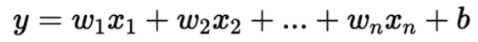
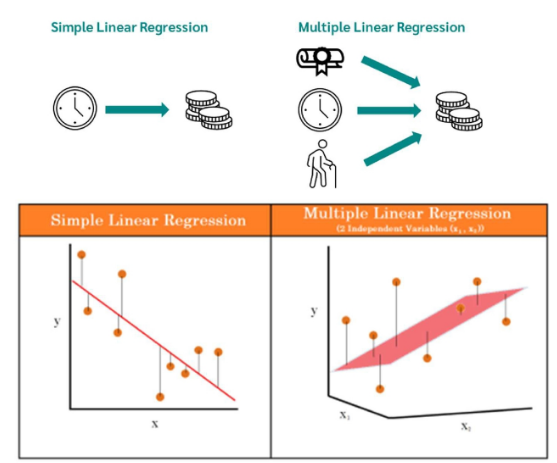
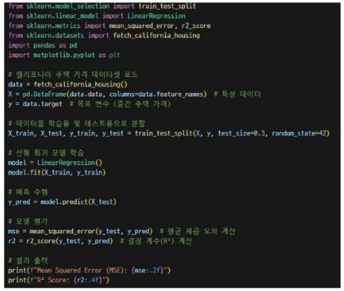

# 다중 회귀
- 여러 개의 입력 변수(특성)을 사용하여 출력 변수를 예측하는 선형 회귀 모델
- 단일 입력 변수를 사용하는 선형 회귀와 달리, 다중 회귀는 다수의 변수를 고려하여 보다 정확한 예측

## 모델의 수식

- 여기서 y는 예측 값, x1, x2, ..., xn은 입력 변수들, w1, w2, ..., wn은 각 특성의 가중치, b는 바이어스

## 예측 방법
- 각 입력 변수에 해당하는 가중치를 곱한 후, 그 값을 모두 더하여 예측 값을 계산
- 모델은 모든 입력 변수의 영향을 고려하여 오차를 최소화하는 방향으로 가중치와 절편을 학습

