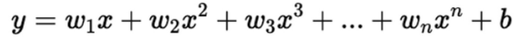
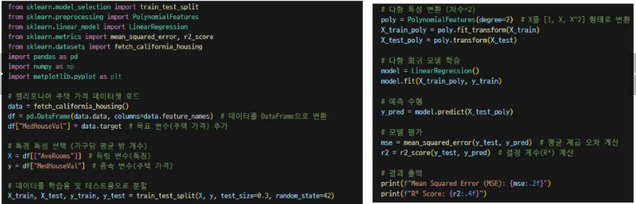

# 다항 회귀란
- 입력 변수와 출력 변수 간의 비선형 관계를 모델링하는 회귀 방법
- 선형 회귀와 달리, 입력 변수의 거듭제곱을 포함한 다향식을 사용하여 비선형 패턴을 학습

## 장점
- 데이터가 비선형적인 경우, 선형 회귀보다 더 나은 예측 성능을 보임
- 다양한 비선형 패턴을 유연하게 모델링 할 수 있음

## 단점
- 과적합의 위험이 큼
- 특히 다항 차수가 높아질수록 모델이 복잡해져 과적합 가능성이 증가
- 데이터가 부족할 경우, 모델이 안정적이지 않을 수 있음

## 사용 예시
- 곡선 패턴이 있는 데이터 예측 : 예를 들어, 온도 변화에 따른 전력 사용량 예측
- 주택 가격 예측에서, 방 개수와 가격 간의 비선형 관계 모델링

## 모델의 수식

- 여기서 y는 예측 값, x는 입력 변수, w1,w2,...,wn은 각 특성의 가중치, b는 바이어스

## 예측 방법
- 입력 값 x의 거듭제곱을 사용해 곡선 형태의 관계를 모델링
- 선형 회귀로는 설명할 수 없는 비선형 패턴을 더 잘 포착 가능

