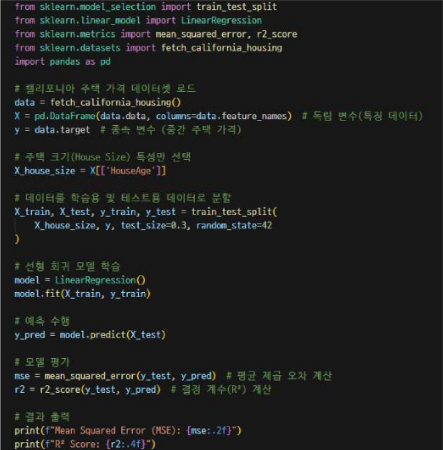

# 선형회귀란
- 입력 변수(특성)와 출력 변수(목표 값) 간의 선형 관계를 가정하여 예측하는 모델
- 데이터가 직선으로 표현될 수 있을 때, 가장 간단하고 직관적인 방법

## 모델의 수식
- y = wx + b
- 여기서는 y는 예측 값, x는 입력 값, w는 웨이트, b는 바이어스

## 예측 방법
- 주어진 데이터를 기반으로 최적의 직선(회귀선)을 찾아 입력 값에 대한 출력 값을 예측
- 모델은 오차를 최소화하는 방향으로 직선의 기울기 w와 절편 b를 학습

## 장점
- 해석이 용이하고 계산이 빠름
- 비교적 단순한 문제에 대해 좋은 성능 발휘

## 단점
- 입력 변수와 출력 변수 간의 관계가 비선형적일 경우 성능이 저하될 수 있음
- 과적합의 위험이 있으며, 다중 공선성이 있을 때 문제가 발생할 수 있음

## 사용예시
- 주택 가격 예측 : 주택 크기에 따른 가격 에측
- 광고 비용과 판매량의 관계 분석
