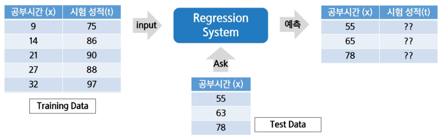
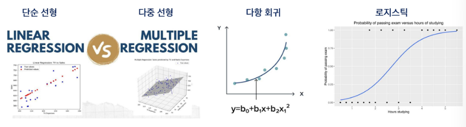

# 회귀(Regression)란 무엇인가?
- 회귀의 정의
    - 회귀는 연속적인 숫자 값을 예측하는 지도 학습의 한 유형
    - 입력 데이터를 기반으로 특정 연속적 목표 값(출력)을 예측하는 것이 목적
- 회귀 문제의 목표
    - 입력 변수(특징)를 사용하여 출력 값의 추세를 학습하고, 이를 기반으로 새로운 데이터에 대해 에측을 수행
- 회귀의 활용 예시
    - 주택 가격 예측 : 집의 크기, 위치, 연도 등의 정보를 바탕으로 가격을 에측
    - 주식 시장 분석 : 과거 주가 데이터를 바탕으로 미래 주가를 예측
    - 날씨 예측 : 기온, 습도, 풍속 등의 데이터를 사용해 내일의 기온을 예측
- 회귀와 분류의 차이점
    - 회귀는 연속적인 값을 예측하는 문제(예:온도, 가격)
    - 분류는 이산적인 범주를 예측하는 문제(예: 스팸/비스팸, 고양이/개)

# 회귀 문제의 예시
- 주택 가격 예측
    - 주택의 크기, 방 개수, 위치 등의 특징(입력 변수)을 기반으로 주택의 가격(출력 변수)을 에측하는 문제
    - 예시: 100m2의 아파트가 5억 원일 가능성을 예측
- 주식 시장 분석
    - 과거 주가 데이터, 거래량, 경제 지표 등을 바탕으로 미래 주가를 예측하는 문제
    - 예시 : 주식 X의 다음 달 가격을 예측
- 날씨 예측
    - 기온, 습도, 풍속 등의 환경 데이터를 바탕으로 다음 날의 기온을 예측
    - 예시 : 내일의 최고 기온을 25도로 예측
- 자동차 연비 예측
    - 자동차의 배기량, 마력, 중량 등의 데이터를 기반으로 연비를 예측
    - 예시 : 특정 차량이 1리터당 12km를 갈 가능성 예측
- 판매량 예측
    - 과거 판매 기록, 계절, 마케팅 투자 등을 통해 미래의 판매량을 예측
    - 예시 : 특정 제품이 다음 달에 1000개 판매될 가능성 예측

# 입력 변수(Features, 독립 변수)
- 회귀 문제에서 입력 변수는 예측에 필요한 다양한 특성을 의미
- 입력 변수는 하나일 수도 있고, 여러 개일 수도 있음
- 예시
    - 주택 가격 예측에서의 입력 변수 : 주택 크기, 위치, 방 개수 등
    - 자동차 연비 예측에서의 입력 변수 : 배기량, 중량, 마력 등

# 출력 변수(Target, 종속 변수)
- 회귀 문제의 출력은 예측하고자 하는 연속적인 값
- 출력 변수는 모델이 학습하여 에측하는 목표 값
    - 주택 가격 예측에서의 출력 변수 : 예측된 주택의 가격
    - 자동차 연비 예측에서의 출력 변수 : 1리터당 이동할 수 있는 거리(km/L)

# 모델의 목적
- 입력 변수(특성)와 출력 변수(목표 값) 간의 관계를 학습해, 새로운 입력이 주어졌을 때 적절한 출력 값을 예측
- 예시 : 주택의 크기와 위치 정보를 입력으로 받아 주택 가격을 예측

# 회귀
- Training Data를 이용해서 데이터의 특성과 상관 관계 등을 파악하고, 그 결과를 바탕으로 Training Data에 없는 미지의 데이터가 주어졌을 경우에, 그 결과를 연속적인(숫자) 값으로 예측하는 것
- 예시 : 공부시간과 시험 성적 관계

# 회귀의 종류
- 단순 선형회귀 : 한 개의 독립변수로 종속변수를 예측, 선형적(1차항 이상의 연산없음). 직선으로 표현
- 다중 선형회귀 : 두 개 이상의 독립변수로 종속변수를 예측, 선형적. 3차원 이상에서 평면으로 표현
- 다항 회귀 : 2차항 이상의 항으로 계산, 다항식
- 로지스틱 회귀 : 범주형 종속변수를 예측하는 분류 모델

