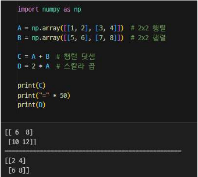
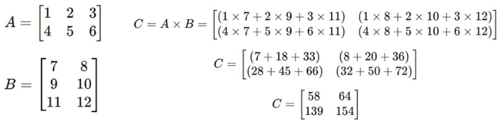
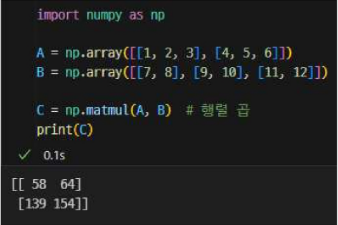
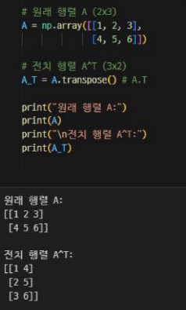
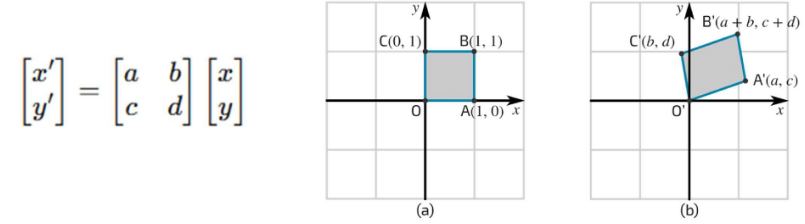
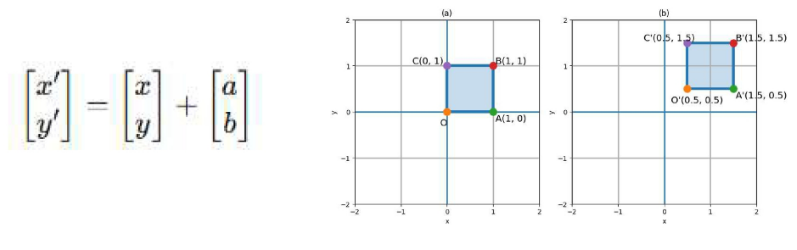
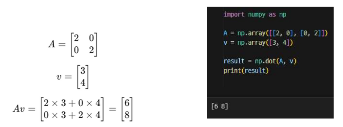

# 머신러닝과 데이터 분석에서 행렬의 중요성
- 데이터를 효율적으로 표현하고, 모델을 학습시키기 위해 행렬 사용
- 데이터 표현 : 대부분의 데이터(이미지, 텍스트, 수치 데이터)는 행렬 형태로 저장
- 머신러닝 알고리즘 : 선형 회귀, 로지스틱 회귀, 신경망 등에서 가중치와 데이터 처리 연산 및 데이터 변형, 차원 축소를 위해 행렬 사용
- 최적화 및 학습 과정 : 경사 하강법 등 최적화 알고리즘 및 딥러닝에서 미분과 행렬 연산 사용

# 행렬(Matrix)란 ?
- 행렬 : 숫자가 행(row)과 열(column)로 배열된 2차원 구조

# 행렬 덧셈과 스칼라 곱
- 행렬 간 덧셈 : 같은 크기의 행렬끼리 요소별로 더함
- 스칼라 곱 : 행렬의 각 요소에 숫자를 곱함

# 행렬 곱(Matrix Multiplication)
- 두 개의 행렬을 곱하는 연산
- A(m * n) X B(n * p) -> 결과 행렬 C(m * p)
- 첫번째 행렬(A)의 열 개수와 두 번째 행렬(B)의 행 개수가 같아야 곱셈 가능
- 예제 : A(2*3) * B(3*2) -> 결과 행렬 C(2*2)

- 머신러닝에서 행렬 곱 사용
- 선형 회귀 (Linear Regression) : 모델의 가중치와 입력 데이터(X)의 행렬 곱을 통해 예측값 계산
- 신경망(Neural Networks) : 각 레이어에서 가중치와 입력 데이터의 행렬 곱 수행

# 전치 행렬(Transpose Matrix)
- 행과 열을 바꾸는 연산
- 행렬 A(m * n)의 전치 행렬 -> AT(n * m)
- 원소 : AT[i,j] = A[j,i]

# 선형 변환
- 선형 변환은 한 벡터 공간의 벡터를 다른 벡터로 대응시키는 변환
- 크기조절, 회전, 대칭, 전단 같은 공간의 형태 변형을 표현
- 수식으로는 행렬 곱 Ax 형태
- 원점을 보존하는 것이 특징
- 데이터의 구조를 바꾸거나, 복잡한 데이터를 다루기 쉽게 만드는데 활용

# 평행 이동
- 공간의 모든 점을 같은 방향, 같은 거리만큼 이동
- 점들의 모양, 방향, 상대적 위치는 변하지 않음
- 좌표에 일정한 값을 더하는 방식으로 구현
- 원점돋 함게 이동하므로 선형 변환은 아님
- 데이터 분석에서는 전처리(센터링) 단게에서 사용

# 크기 변경(Scaling)
- 벡터를 일정 배율로 확대 또는 축소하는 변환
- 스칼라 곱으로 표현 가능
