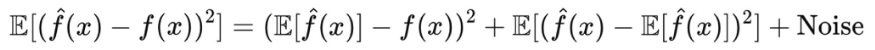
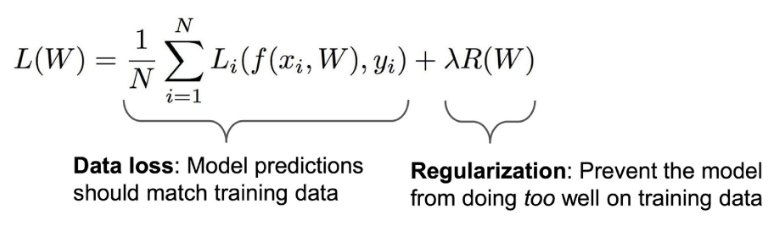
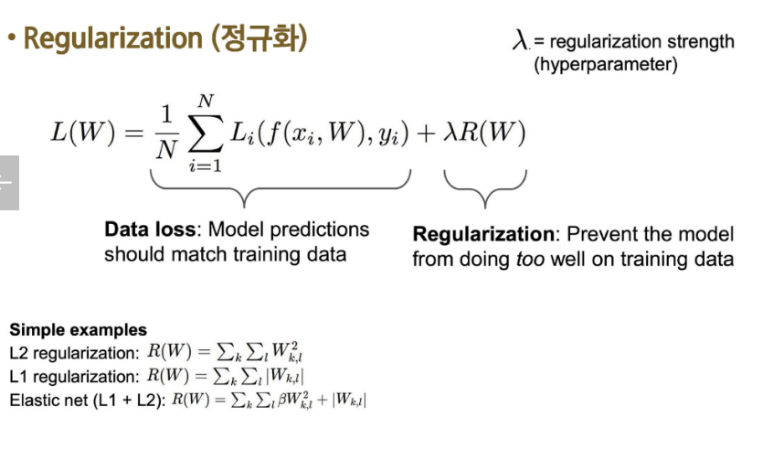

# 예측 오차의 구성
- 머신러닝 모델의 총 예측 오차는 크게 세 가지 요소로 나눔
    - 편향(Bias) : 모델이 단순화되어 발생하는 오류
    - 분산(Variance) : 모델이 데이터의 작은 변화에 민감하게 반응하여 발생하는 오류
    - 불확실성(Noise) : 데이터 자체의 본질적인 변동성
- 총 오차 = 편향의 제곱 + 분산 + 불확실성

# Bias-Variance Trade-Off
- Bias(편향)
    - 모델이 실제 데이터 패턴을 단순화하여 학습
    - 편향이 높으면 : 복잡한 패턴을 제대로 학습하지 못해 언더피팅(Underfitting)
    - 결과 : 학습 데이터와 테스트 데이터 모두에서 성능이 낮음
- Variance(분산)
    - 모델이 학습 데이터에 민감하여 작은 변화에도 큰 차이를 보임
    - 분산이 높으면 : 학습 데이터에 과적합하여 오버피팅(Overfitting)
    - 결과 : 학습 데이터에서는 성능이 좋지만, 테스트 데이터에서는 성능 저하
- Bias-Variance Trade-Off
    - 모델의 복잡도를 조절하면서 편향과 분산 간의 균형을 맞추는 것
    - 복잡도가 높으면 : 편향 ↓, 분산 ↑ (오버피팅 위험)
    - 복잡도가 낮으면 : 편향 ↑, 분산 ↓ (언더피팅 위험)
- 최적화 목표
    - Bias와 Variance를 모두 최소화해 일반화 성능을 극대화
    - 해결방법 : 교차 검증, 정규화, 모델 튜닝

# Regularization(정규화)

- 왜 정규화를 할까
    - 가중치에 대한 선호를 표현하기 위해
    - 모델을 단순하게 만들어 테스트 데이터에서도 잘 작동하도록 하기 위해
    - 곡률을 추가하여 최적화를 개선하기 위해
