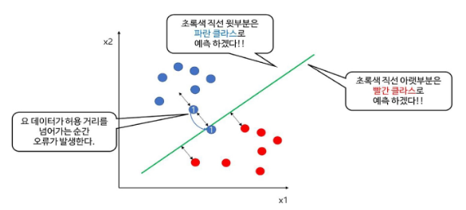
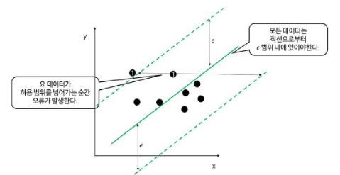
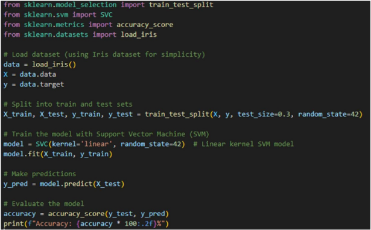

# 서포트 벡터 머신(SVM)
- 서포트 벡터 머신은 여백(Margin)을 최대화하는 초평면(Hyperplane)을 찾는 지도 학습 알고리즘
- 딥러닝의 대두 이전까지 분류, 회귀에 모두 사용할 수 있는 매우 강력한 모델

## 작동방식
- 1. 초평면 결정 : 두 클래스 사이의 간격을 최대화하는 초평면을 찾음
- 2. 서포트 벡터 : 초평면에 가장 가까운 데이터 포인트들이 서포트 벡터 역할을 하며, 이들이 결정 경계를 형성
- 3. 비선형 데이터 처리 : 커널 트릭(Kernel Trick)을 사용하여 비선형 데이터를 고차원 공간으로 변환한 후, 선형 분리를 수행할 수 있음

## 장점
- 상대적으로 데이터의 이해도가 떨어져도 사용이 용이함
- 예측 정확도가 통상적으로 높음

## 단점
- C(에러에 부여하는 가중치)를 결정해야 함
- 파라미터의 결정과 모형의 구축에 시간이 오래걸림

## 여백의 의미
- 주어진 데이터가 오류를 발생시키지 않고 움직일 수 있는 최대공간
- 분류 문제와 회귀 문제 각각의 문제에 따라 정의가 다름

## 최적의 결정 경계
- 최적의 결정 경계는 데이터 군집으로부터 최대한 멀리 떨어지는 것

## 분류에서의 여백(Margin)
- 데이터가 2차원이며, 라벨은 파란색과 빨간색 두개의 클래스가 있다고 가정
- 이를 분류하는 초평면은 초록색 직선이고, 1번 데이터를 기준으로 해당 데이터가 직선과 수직으로 움직인다면 1번 데이터가 직선을 초과해 움직이면, 해당 데이터를 직선이 빨간색 데이터로 예측해 오류가 발생
- 즉, 파란색 1번 데이터와 직선과의 거리가 여백(Margin)임

## 회귀에서의 여백(Margin)
- 단순 선형 모델(설명 변수 1개)를 생성하고, 데이터들이 초평면으로 부터 e > 0 범위 내에 있다고 가정
- 데이터들은 초록색 직선으로 부터 e 범위(양쪽 점선 사이)에 있으며, 데이터들은 x축 상에서 움직임
- 양 점선 사이의 수평거리를 데이터가 넘어가게 되면 e 범위를 넘어가게 되어 오류를 발생시킴
- 즉, 양 점선 사이의 수평거리가 여백(Margin)임

# Soft Margin vs Hard Margin
- Sorft Margin
    - Soft Margin은 결정 경계를 조금씩 넘어가는 데이터들을 어느 정도 허용하여 유연한 결정 경계를 만듦
    - 아래와 같은 데이터 분포는 직선으로 두 클래스를 분류하기 어렵기 때문에 어느 정도의 비용(Cost, C)을 감수하면서 가장 최선의 결정 경계를 찾음
    - Cost는 모델링을 하면서 설정이 가능하고, 이 값이 크면 클수록 Hard Margin을, 작으면 작을수록 Soft Margin을 만듦

- Hard Margin
    - Hard Margin은 이상치들을 허용하지 않고, 분명하게 나누는 결정 경계를 만듦
    - 과적합(Overfitting)의 오류가 발생하기 쉬움
    - 노이즈로 인해 최적의 결정 경계를 잘못 설정하거나 못 찾는 경우가 발생할 수 있음

# Kernel Trick
- 데이터를 고차원으로 보내서 서포트 벡터를 구하고 다시 저차원으로 축소하는 과정은 복잡하고 많은 연산량이 필요하기 때문에 Kernel Trick을 사용
- Kernel Trick은 선형 분리가 불가능한 저차원 데이터를 고차원으로 보내 선형 분리를 하는 이론을 이용한 일종의 Trick 기법
- Kernel Trick은 고차원 Mapping과 고차원에서의 연산이 가능함

# 대표적인 Kernel 함수
- Linear : 선형함수
- Poly : 다항식 함수
- RBF : 방사 기저 함수
- Hyperbolic Tangent : 쌍곡선 탄젠트

