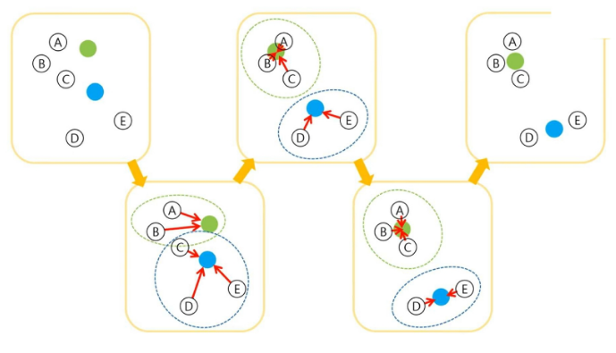
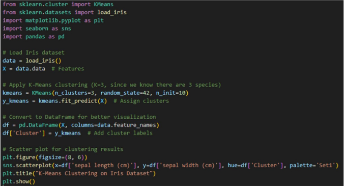

# 군집(Clustering)
- 군집 분석은 비슷한 특성을 가진 데이터를 그룹화하는 비지도 학습 기법
- 데이터의 내재된 구조를 발견하고, 패턴을 파악하는데 활용
- 마케팅 세분화, 이상치 탐지, 추천 시스템 등 다양한 분야에서 사용

# K-평균(K-means clustering)
- K-평균 알고리즘은 가장 대표적인 군집화 알고리즘
    - 1. 사용자가 지정한 k개의 군집 중심점을 초기화하고, 반복적으로 업데이트
    - 2. 각 데이터 포인트를 가장 가까운 군집 중심점에 할당하고, 군집 중심점을 재계산하는 과정을 수렴할 때까지 반복
- 간단하고 빠르지만, K 값을 사전에 지정해야 함

