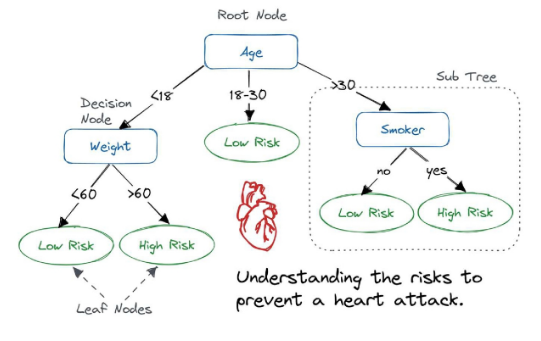
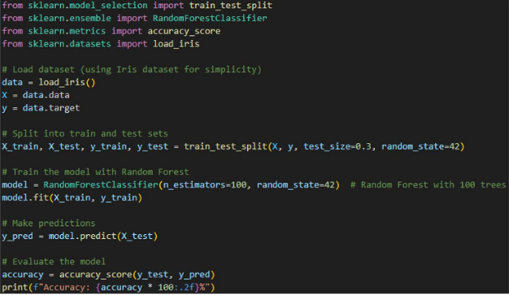

# 의사결정 트리(Decision Tree)
- 의사결정 트리는 분류, 회귀 문제에 모두 상요할 수 있는 모델
- 의사결정 트리는 입력 변수를 특정한 기준으로 분기해 트리 형태의 구조로 분류하는 모델

## 장점
- 해석이 쉬움
- 입력 값이 주어졌을 때 설명 변수의 영역의 흐름을 따라 출력값이 어떻게 나오는지 파악하기 용이

## 단점
- 예측력이 떨어짐
- 단순히 평균 또는 다수결 법칙에 의해 예측을 수행
- 회귀모델에서 반응 변수의 평균을 예측값으로 추정할 때 평균을 사용해 이상치에 영향을 많이 받음

## 구성

## 앙상블 학습(Ensemble Learning)
- 여러 개의 분류기를 생성하고, 그 예측을 결합함으로써 보다 정확한 예측을 도출하는 기법
- 강력한 하나의 모델을 사용하는 대신 보다 약한 모델 여러 개를 조합하여 더 정확한 예측에 도움을 주는 방식
- 보팅(Voting), 배깅(Bagging), 부스팅(boosting) 세 가지의 유형이 존재

## 보팅(Voting)
- 여러 개의 분류기가 투표를 통해 최종 예측 결과를 결정하는 방식
- 서로 다른 알고리즘을 여러 개 결합하여 사용

## 보팅 방식
- 하드 보팅(Hard Voting) : 다수의 분류기가 예측한 결과값을 최종 결과로 선정
- 소프트 보팅(Soft Voting) : 모든 분류기가 예측한 레이블 값의 결정 확률 평균을 구한 뒤 가장 확률이 높은 레이블 값을 최종 결과로 선정

## 배깅(Bootstrap AGGregatING, Bagging)
- 데이터 샘플링(Bootstrap)을 통해 모델을 학습시키고 결과를 집계(Aggregation)하는 방법으로 모두 같은 유형의 알고리즘 기반의 분류기를 사용
- 데이터 분할 시 중복을 허용
- 범주형 데이터는 다수결 투표 방식으로 결과 집계
- 연속형 데이터는 평균값 집계를 활용, 과적합(overfitting) 방지에 효과적

## 부스팅(Boosting)
- 여러 개의 분류기가 순차적으로 학습을 수행
- 이전 분류기가 예측이 틀린 데이터에 대해서 올바르게 예측할 수 있도록 다음 분류기에게 가중치(weight)를 부여하면서 학습과 예측을 진행
- 예측 성능이 뛰어나 앙상블 학습을 주도
- 보통 부스팅 방식은 배깅에 비해 성능이 좋지만, 속도가 느리고 과적합이 발생할 가능성이 존재하므로 상황에 따라 적절하게 사용해야 함
- 대표적인 부스팅 모듈 XGBoost, AdaBoost, Gradient Boosting

## 랜덤 포레스트(Random Forest)
- 여러 개의 결정 트리들을 임의적으로 학습하는 방식의 앙상블 방법
- 여러가지 학습기들을 생성한 후 이를 선형 결합하여 최종 학습기를 만드는 방법
- 기반 기술
    - 의사결정 트리 : 여러가지 요소를 기준으로 갈라지는 가지를 트리형태로 구성하여 분석하는 기법
        - 의사결정 트리의 한계
            - 학습 데이터에 따라 생성되는 결정 트리가 크게 달라져 일반화가 어려운 과적합 문제 발생
            - 계층적 접근방식으로, 중간에 에러 발생 시 하위 계층으로 에러
    - 앙상블 학습 : 주어진 데이터를 여러 모델로 학습하고 종합하여 정확도를 높이는 기법
    - 배깅(Bagging) : 같은 알고리즘으로 여러 개의 분류기를 만들어서 결합하는 앙상블 학습 기법
- 특징 :
    - 임의성 : 서로 조금씩 다른 특성의 트리들로 구성
    - 비상관화 : 각 트리들의 예측이 서로 연관되지 않음
    - 견고성 : 오류가 전파되지 않아 노이즈에 강함
    - 일반화 : 임의화를 통한 과적합 문제 극복
- 장점
    - 과적합이 잘 일어나지 않음
    - 결측치나 이상치에 강함
    - 의사결정나무 알고리즘에 기반한 기법이기 때문에 scaling, 정규화 과정이 필요 없음
    - 비선형적 데이터에 강함
    - 새로운 데이터가 들어와도 크게 영향을 받지 않음
- 단점
    - 수 많은 트리를 계산하기 때문에 학습 시간과 계산 연산량이 큼
