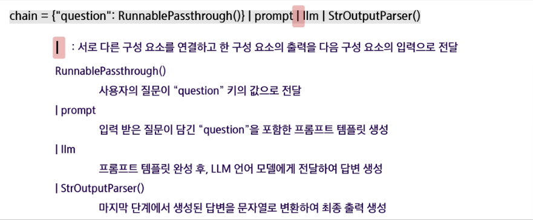
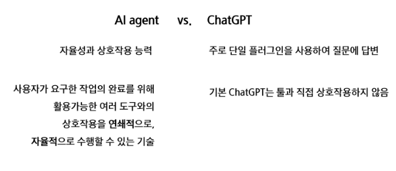

# LangChain
- ChatGPT 프로그램 안에서 벗어나 LLM의 기능을 나만의 코드(Javascript, Python)으로 가져와서 이를 자유자재로 사용할 수 있게 해주는 강력한 "프레임워크"
- LLM으로 하는 모든 것을 LangChain을 통해서 할 수 있음을 의미
    - 프롬프트 엔지니어링
    - RAG
    - Agent
    - 외부 LLM API 사용 및 Local LLM 구동
    - Moderation

- LLM : 초거대 언어모델, 생성 모델의 엔진과 같은 역할을 하는 핵심 구성요소
    - 예시 : GPT-4, PALM, LLAMA, Deepseek...
- Prompts : 초거대 언어모델에게 지시하는 명령문
    - 예시 : Prompt Templates, Chat Prompt Template, Example Selectors
- Index : LLM이 문서를 쉽게 탐색할 수 있도록 구조화 하는 모듈
    - 예시 : Document Loaders, Text Splitters
- Chain : LLM 사슬을 형성하여 연속적인 LLM 호출이 가능하도록 하는 핵심 구성 요소
    - 예시 : LLM Chain, Question Answering, Summarization
- Agents : LLM이 기존 Prompt Template으로 수행할 수 없는 작업을 가능케 하는 모듈
    - 예시 : Custom Agent, Custom MultiAction Agent,

# LCEL(LangChain Expression Language)

# AI Agent
- 사용자의 목표를 달성하기 위해 스스로 문제를 분석하고, 해결 가능한 작은 작업 단위로 분해(Plannig)한 뒤, 필요시 외부 툴이나 API를 활용하여 작업을 수행하며, 결과를 반복적으로 검토(Self-Reflection)하고 개선하는 시스템

## Tool
- AI가 혼자 해결하기 어려운 작업을 도와주는 보조 도구
- 특정 작업을 위해 외부 기능이나 전문가를 불러오는 개념
- 예시 : PDF읽기, 웹 검색, 코드 실행