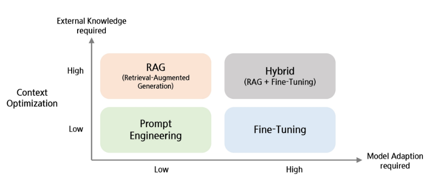
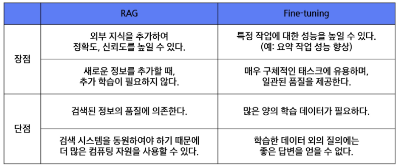
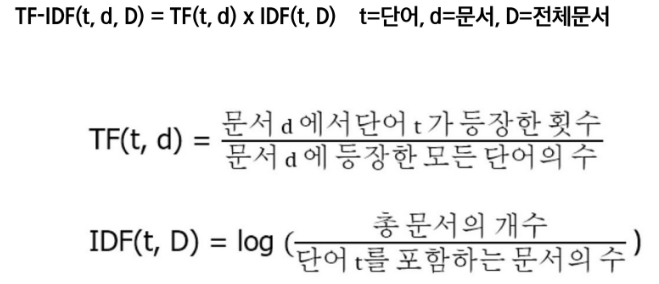
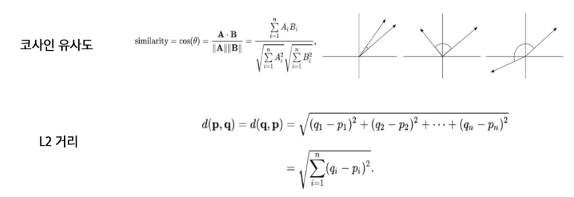
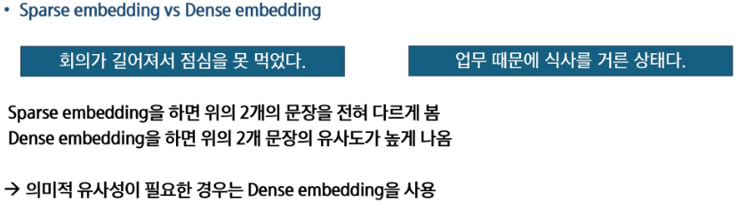

# LLM의 한계
- 오래된 정보
- 도메인 특화 능력 부족
- 거짓말을 잘함
- 지식 매개변수화 효율성이 낮음

VS

# 실제 우리의 요구사항
- 도메인별 정확한 답변
- 빈번한 데이터 업데이트
- 생성된 콘텐츠의 추적성 및 설명성
- 데이터의 개인정보 보호

# RAG
- 입력 프롬프트와 검색 기반의 정보를 결합(증강)하여, 증강된 정보를 기반으로 답변을 생성하도록 하는 방식
- 사전 훈련된 모델을 특정 작업이나 데이터셋에 맞게 추가적으로 조정하는 방식

# RAG(Retrieval-Augmented Generation)
- Retrieval(검색) : 외부 데이터 및 소스를 검색하여 정보 획득
- Augmented(증강) : 사용자의 질문을 보강하여 보다 정확한 문맥 제공
- Generation(생성) : 향상된 정보를 기반으로 더 좋은 답변 생성
- 답변할 때 확실한 출처를 기반으로 생성하게 됨

# RAG 장점
- 환각 현상(Hallucination) 감소
- 도메인 적응성 개선
- Open domain QA 성능 향상
- 참고한 Knowledge base가 적절한지 판단 가능
- 정보 검색에 강함

# RAG 이해를 위한 이론
- 정보 검색(Retrieval)
    - 필요한 정보를 검색하는 작업
    - 데이터베이스, 인터넷, 또는 다른 정보 저장소에서 관련 정보를 찾아내는 과정
    - 사용자의 쿼리에 가장 잘 맞는 데이터를 식별하고 추출하는 기술과 알고리즘
    - 웹 검색 엔진, 디지털 도서관, 온라인 데이터베이스, 정보 검색 시스템 등 다양한 분야에서 중요한 역할 수행

- 역색인(Inverted index)
    - 색인 : 1-> 1페이지 호출, 100 -> 100페이지 호출
    - 각 데이터에 빠르게 접근할 수 있도록 도움
    - 역색인 : "학교" -> 3, 49, 100 페이지
    - 각 단어로 색인 정보를 연결 시켜 놓음으로 단어 기반 검색이 가능케 함

- TF-IDF

- BM25
    - TF-IDF의 정보검색에서의 단점을 보완
    - Q : 사용자가 입력한 쿼리
    - D : 대조해보려는 문서
    - 대부분의 텍스트 기반 검색을 진행할 때 가장 자주 쓰이는 방식
    

- BM25 정보 검색
- 유사도 알고리즘

- Sparse embedding
    - 대부분의 값이 , 몇몇 위치만 1인 벡터로 표현
    - 문장에 나오는 단어의 빈도를 기준으로 벡터를 만듦
    - Tf-Idf, BM25 등
    - 겹치는 단어가 있으면 유사도가 높게 나오지만 단어 간의 의미적인 관계를 포착하지 못함
- Dense Embedding
    - 의미를 나타내는 실수 값들로 이루어진 벡터로 표현
    - BERT와 같은 Pretrained Langhuage Model이 주로 사용 됨

- 상용 LLM
    - 텍스트 생성, 이해, 번역 등 다양한 NLP 작업을 수행
    - 매우 큰 텍스트 데이터 세트에서 학습
    - 높은 정확도와 자연스러운 언어 생성
    - ex : 제미나이, GPT

- RAG
    - 정보검색과 응답 생성을 결합한 모델
    - 사용자의 질문이 주어지면, Retriever는 관련된 정보나 문서를 데이터베이스에서 검색
    - 검색된 정보로 질문에 대한 답변 생성
    - 보다 풍부하고 정확한 정보를 제공 가능
    