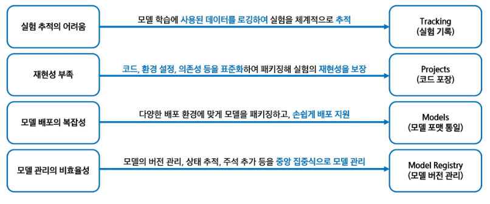

# MLFlow 정의
- MLFlow는 실험의 전체 생애주기(Lifecycle)를 관리하는 오픈소스 플랫폼
- 머신러닝 모델을 만들고 실험하고 배포하기까지의 과정을 더 체계적으로 재현 가능하게 관리 해주는 도구

# MLFlow의 등장 배경
- 2018년도 Databricks에서 개발
- 다양한 프레임워크에 독립적이고, 설치도 간편한 오픈소스
- 실험기록, 모델 저장, 버전 관리, 배포를 하나로 지원
- MLFlow는 "머신 러닝 실험의 Git" and "운영 자동화 도구"

# 왜 필요?
- 기존 머신러닝 운영의 문제점을 MLFlow의 핵심 기능 4가지로 해결(Tracking, Projects, Models, Model Registry)

# MLFlow 4대 컴포넌트
- Tracking : 머신러닝 실험에서 사용된 파라미터, 메트릭, 아티팩트 등을 기록하고 추적
- Projects : 재사용 가능한 형태로 머신러닝 코드를 패키징하여 표준 형식으로 제공
- Models : 다양한 배포 환경에 맞게 모델을 패키징 가능
- Models Registry : 모델의 버전 관리, 상태 추적, 주석 추가 등을 통해 중앙 집중식으로 모델을 관리

# MLFlow 장점
- 협업 향상
    - 중앙 집중화된 실험 관리
        - -> MLFlow는 실험 데이터를 중앙에서 관리하여, 팀원들이 실험 결과를 공유하고 협업하도록 지원
- 실험 추적 효율화
    - 자동 로깅
        - -> 모델 학습 시 사용된 파라미터, 메트릭, 아티팩트 등 로그를 자동으로 기록하여 실험을 체계적으로 추적
- 재현성 강화
    - 환경 및 코드 패키징
        - -> MLFlow는 코드와 실행 환경을 패키징하여, 동일한 조건에서 실험을 재현 가능