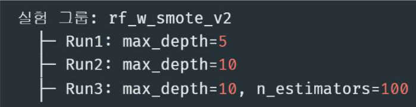
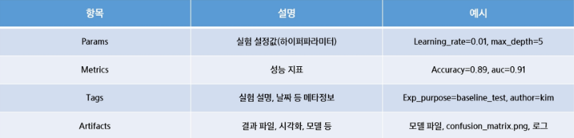
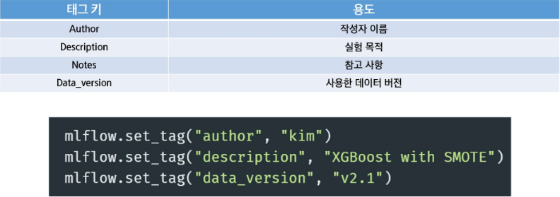
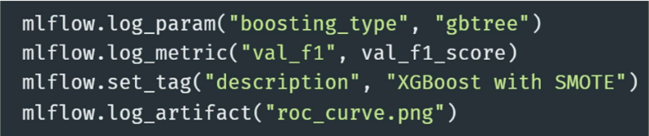
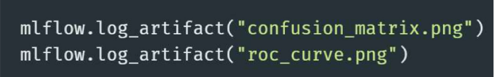
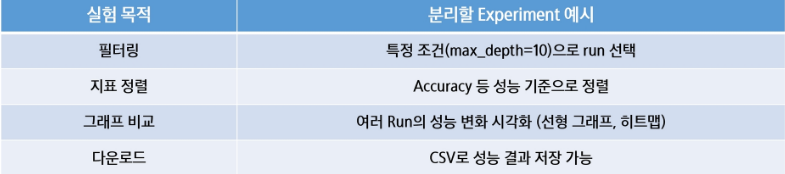
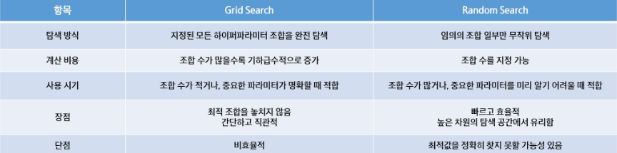

# 실험 관리 전략이란
- 실험을 체계적으로 계획하고 수행하고 비교 분석하는 전 과정
- 실험 목표 수립 -> 실험 단위 정의 -> 비교 가능한 실험 설계 -> 자동화
- 예시로 실험 목적에 따른 실험 공간을 분리해서 관리 할 수 있음

## 실험 결과 저장 위치 구조
- Mlflow 실험 디렉토리 구조
    - MLFlow는 실험 데이터를 기본적으로 mlruns/ 디렉토리에 저장
    - 로컬 저장 기준이며, 백엔드 저장소를 바꾸면 DB/S3 등에 저장 가능
    - 추가로 Mlflow UI에 접속하여 해당 Run을 클릭하면 파일 구조를 확인 가능
    - 디렉토리 : 
        - Metrics/ : 실험 성능 지표 파일들
        - Params/ : 하이퍼파라미터 저장
        - Artifacts/ : 모델, 이미지 등 결과물
        - Meta.yaml : 사용한 데이터 버전

## 실험 단위 구분
- 실험 단위 구분 전략 : 실험 그룹/Run 이름 정리법
    - 실험 그룹 : baseline_rf_exp1, tuned_rf_exp2
    - Run 이름 : max_depth=5, max_depth=10
    - 모델/데이터/전처리 조합에 따라 Run 그룹화
    - 파일 이름 형식도 "모델명_전처리 방법_데이터셋 버전"으로 하면 명확함
    

- 실험 정보를 체계적으로 기록하는 방법
    - Mlflow는 실험 정보를 4가지 요소로 구분해 기록
    - 각각의 정보는 비교, 분석, 재현성에 중요한 역할을 가짐
    - Params -> 실험 조건, Metrics -> 성능 결과, Tags -> 설명 요약, artifact -> 결과물 저장소
    

- MLFlow는 메타 정보 태그화
    - UI와 API에서 태그 기반 검색이 가능함 -> 실험 분류 / 필터링에 유용
    - 아래 예시처럼 사용 가능
    

## 커스텀 로깅 전략
- 중요한 정보를 직접 로깅하는 방법
    - Mlflow는 기본 로깅 외에도 내가 원하는 정보를 자유롭게 추가 가능
    - 모델의 의미 있는 지표를 따로 로깅 가능(val_f1, recall 등)
    - 태그에 설명을 담아 UI에서 실험의 목적, 주요 이벤트도 기록이 가능
    

## 고급 실험 로깅
- 자동화된 실험 반복 + 시각화 저장하는 방법
    - GridSearch나 반복 실험에서 각 결과를 자동으로 MLFlow에 로깅하면 관리가 편함
    - 실험별 파라미터, 지표 로깅, ROC curve, confusion matrix 이미지를 생성 후 저장
    - 반복 실험이 많을수록 자동 로깅 코드 구조화는 필수
    - 시각화 파일도 artifact로 저장하면 UI 상에서 바로 확인이 가능함
    

## 실험 비교 전략
- 실험 결과를 효율적으로 비교하는 방법
    - MLflow UI에서는 다양한 실험을 필터링, 정렬, 시각화하며 비교 가능
    - 파라미터 조합별 성능 비교가 쉬워짐
    - 성능이 아니라, 실험 설정 자체에 주목 가능
    

## 실험 실패 / 중단 상황 관리
- Try...finally / try...except + mlflow.end_run()
    - 실험이 끝나면 mlflow.end_run() 명령어를 통해 명시적으로 종료해줘야 로그가 깔끔하게 남음
    - 하지만 에러가 나면 종료가 누락될 수 있음

## 실험 자동화 흐름 예시
- Config.yaml에 실험 조건 정의
    - 반복할 실험의 조건(예: 하이퍼파라미터)을 YAML 파일에 정의해두면, 실험을 체계적으로 구성하고 재사용 가능
    - 아래는 config.yaml 예시
- Itertools.product 또는 반복문으로 조합 생성
    - 모든 실험 조합을 만들기 위해 Python의 itertools.product를 사용하거나 중첩 반복문을 사용 할 수 있음
- Mlflow.start_run() 블록 안에서 파라미터와 결과를 자동으로 로깅
    - 각 조합에 대해 하나의 실험(run)이 생성되며, 비교/시각화에 활용

## 실험 관리 전략 팁
- 실험을 전략적으로 관리
    - MLFlow는 실험 전략 실행 플랫폼
    - 실험 이름/구조 설계 -> 자동화된 로깅 -> 정리된 비교 -> 재현성 확보
    - 단순 로그 기록이 아니라, 모델 실험을 반복 가능한 연구 활동으로 만드는 도구
- 실험 관리 시 유용한 팁 3가지
    - 실험명 관리 : 실험 목적, 날짜 포함
    - Jupyter 요약 정리 : mlflow.search_runs()로 테이블 생성
    - 중단 대비 로깅 : try-finally로 중간 로그 남기기

## MLFlow 하이퍼파라미터 튜닝
- 하이퍼파라미터 튜닝의 중요성
    - 하이퍼파라미터는 학습 알고리즘의 학습 방식에 직접적인 영향을 미침
    - 잘 튜닝된 모델 vs 기본값 모델 -> 성능 차이가 상당함
    - GridSearch, RandomSearch, HyperOpt 등의 사용

- Grid Search vs Random Search 개념 정리
    - 하이퍼파라미터 튜닝의 대표적인 2가지 기법
    

- Hyperopt 란
    - 머신러닝 모델의 파이퍼파라미터 튜닝을 자동으로 수행해주는 라이브러리
    - 핵심 목표는 최적의 파라미터 조합을 효율적으로 찾는 것
- Hyperopt 특징
    - 목적 기반 최적화 : 단순 반복이 아닌, 성능을 기반으로 검색
    - 이전 결과 학습 : 과거 실험 결과를 기반으로, 다음 탐색 위치를 정교하게 조정
    - 계산량 절약 : 수백 개 실험을 거치지 않아도 좋은 조합에 빠르게 수렴
    - 다양한 공간 지원 : 실수형, 정수형, 범주형, 조건부 파라미터 등 복잡한 탐색 구조 지원