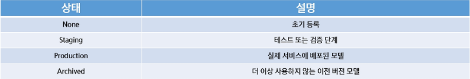
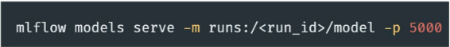
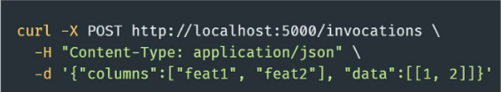
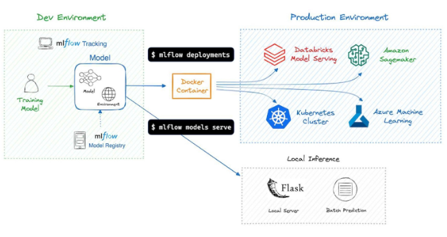
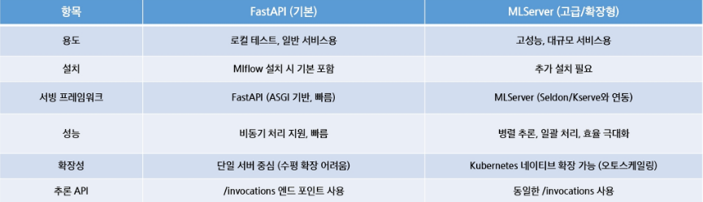

# MLFlow 모델 관리 및 배포
- 실험 결과로 나온 모델 
    - ML 실허므이 목적은 결국 좋은 모델 찾는 것
    - 성능 좋은 모델을 저장, 버전 관리, 배포할 수 있어야 실무에 사용 가능
    - MLFlow는 이 과정을 Tracking과 연결된 모델 저장 시스템으로 처리

- Stage란
    - MLFlow Model Registry에서 하나의 모델 버전이 어떤 배포 단계에 있는지를 표시하는 상태 값
    - MLFlow에서 모델은 다음과 같은 "stage" 상태를 가질 수 있음

- 상태
    - 모델 개발 및 실험 -> None
    - 성능 검증 후 테스트 환경 배포 -> Staging
    - QA 통과 후 서비스 배포 -> Production
    - 새 모델로 교체되면 이전 모델 -> Archived
    

- 모델 버전 관리
    - MLFlow에서는 하나의 모델 이름 아래 여러 버전의 모델을 등록할 수 있음
    - 최근에는 Alias 방식이 도입되면서, 자유로운 문자열로 여러 버전으로 저장 가능

- 새로운 방식 : Alias
    - 여러 alias를 동일 버전에 연결할 수 있고, 하나의 alias를 쉽게 다른 버전으로 전환 가능
    - 버전 관리 + 배포 환경 + 실험 그룹을 명확하게 구분이 가능

# MLFlow models 구조 소개
- MLFlow 구성요소 및 개념
    - 모델 포맷(Flavor) : 다양한 프레임워크 지원(sklearn, keras, xgboost 등)
    - 모델 경로 : run ID 기반으로 저장
    - 환경 정보 : conda.yaml, Mlmodel, requirement.txt 자동 생성
- 모델 저장의 필요성
    - Pickle, joblib : 간단하지만 환경 정보 없음, 코드 추적 불가
    - MLFlow Models : 모델뿐 아니라 실험 환경, 입력 형태, 프레임 워크 정보까지 저장 가능
    - 핵심은 실험 결과를 재현하고 협업하려면 단순한 .pkl 파일로는 부족

# MLFlow 모델 저장 방법
- 모델 저장 방법
    - Log_model()은 모델 객체와 함께 실행 환경 정보까지 함께 저장
    - UI에서도 해당 모델 확인 가능
    - 모델을 저장하면서 자동으로 artifact에 등록
- 저장된 모델 불러오기
    - 모델 검증 시, 추론 테스트를 위해 저장된 모델 불러오기
    - 모델 서빙 시, API 배포에 활용
    - Mlflow.pyfunc.load_model()을 사용하면 공통 인터페이스로 불러올 수 있음

- 모델 저장 위치 설정(로컬vs원격)
    - 로컬 디스크 : 기본 설정, 간단한 실험에 적합
    - S3, GCS : 팀 프로젝트, 클라우드 기반 실험에 적합
    - 데이터베이스(e.g. SQLite, MySQL) : 실험 메타데이터 저장 용도로도 활용 가능

# 모델 관리 및 배포
- 모델 경량화 및 구조 분석 팁
    - 저장된 Mlmodel 파일에는 모델 flavor, 입력/출력 signature 정보가 있음
    - Signature를 정의하면 추론 시 입력 형태를 자동 검증 가능

- 모델 관리 배포의 흐름
    - 모델 저장 -> 로딩 -> 예측
    

- 로컬 환경에서 API로 서빙하기
    - Mlflow 서빙 명령어를 통해 배포 가능
    

- 기본 구성
    - RESTful API 방식
    - /invocations 엔드포인트로 JSON 데이터로 POST
    

# MLflow 모델 서빙
- Mlflow 서빙은 훈련된 머신러닝 모델을 운영 환경에 쉽게 배포할 수 있도록 도와주는 도구

- Mlflow로 모델을 서빙할 때 선택할 수 있는 엔진

# MLflow 모델 서빙 환경 및 확작성
- 서버 환경 고려사항
    - 
- Mlflow Models의 확장성
    - 다양한 프레임워크 지원 : scikit-learn, tensorflow, xgboost, pytorch 등과 연동 가능
    - 이식성 : Databricks, AWS SageMaker 등 다양한 플랫폼에 배포 가능
    - 모델 관리 연계 : 추후 Model Registry, 서빙 인프라(API Gateway 등)와 자연스럽게 연결됨
    - 통합 구조 : 모델 저장 -> 로딩 -> 배포까지 하나의 포맷으로 처리 가능 (MLmodel + artifact)
