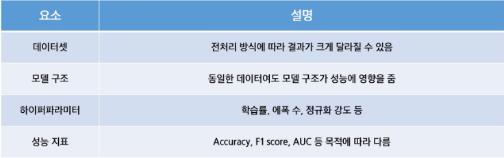
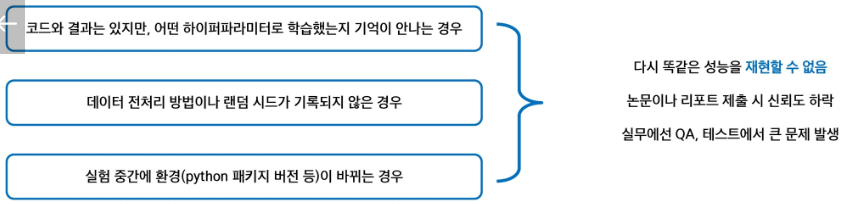
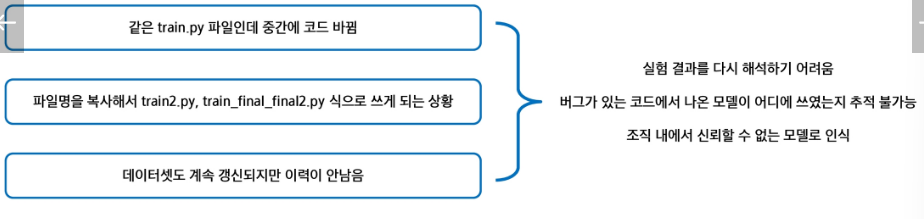
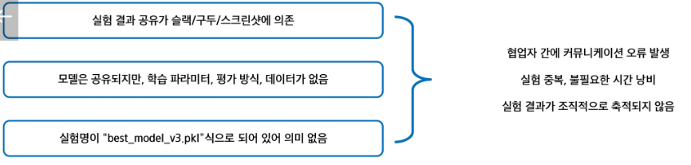

# 머신러닝 실험
- 모델의 성능을 개선하거나 다양한 설정을 비교 분석하기 위해 반복적으로 수행하는 과정 중심의 실험 활동
- 즉, "어떤 데이터를 써서", "어떤 알고리즘에", "어떤 하이퍼파라미터를 적용했더니", "어떤 결과가 나왔는지" 체계적으로 비교하는 작업

## 왜 중요한가
- 머신러닝에서는 하나의 정답이 존재하지 않고, 여러 조건에 따라 성능이 달라지기 때문에 실험이 필수적

## 반복 실험의 문제점
- 왜 문제 생길까
    - 엑셀에 기록하다 보면 어느 실험이 어떤 설정인지 기억하기 어려움
    - 실수로 같은 실험을 중복 진행하거나, 더 좋은 모델을 잃어버림
    - 여러 명이 협업할 때 "이 모델이 어디서 나온건지"라는 상황 발생
- 재현성(Reproducibility)의 문제
    - "이 모델이 왜 잘 나왔는지, 다시 만들 수 있을까?"
    
- 버전 관리의 문제
    - "이 모델, 어떤 코드 버전에서 나온 거였지?"
    
- 협업의 문제
    - "동료가 만든 모델, 어떻게 학습된 건지 모르겠어요"
    
- 비효율적인 반복 작업
    - "똑같은 실험, 이미 했던 상황"
    
- 성과 측적 및 비교의 어려움
    - "결국 어떤 모델이 제일 좋았는지 알 수 없는 경우"
    

## 실험 추적 및 관리 도구
- 실험 추적 도구의 필요성
    - 반복 실험에서 발생하는 문제를 해결하기 위함
    - 실험마다 사용된 코드, 데이터, 하이퍼파라미터, 성능 지표를 자동으로 기록
    - 실험 결과를 비교 분석할 수 있는 인터페이스 필요

- 실험 환경 자동화의 필요성
    - 실험은 단순 로깅응ㄹ 넘어서, 재현 가능한 환경에서 실행되어야 함

- 실험 추적 + 모델 저장 + 서빙까지 지원하는 통합 도구 : MLFlow
    - MLFlow는 오픈 소스로 제공되는 머신러닝 실험 관리 플랫폼
    - 다양한 프레임워크와 호환성이 좋음
    - 실험 로그 관리 뿐 아니라 모델 저장, 등록, 서빙까지 한번에 가능

