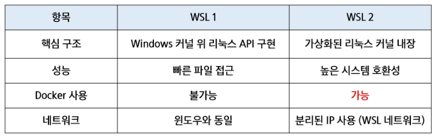

# WSL
- Windows 환경에서 리눅스를 실행할 수 있도록 도와주는 도구
- 윈도우에서 리눅스를 가상 머신 없이 실행
- 명령어, 파일 시스템, 리눅스 도구 사용 가능
## 장점
- 별도 리눅스 컴퓨터가 없어도 Windows에서 바로 리눅스 사용 가능
- Docker, Python, Git 등 리눅스 친화 도구 활용이 쉬움
- VM 대비 가볍고 빠르며, 설치가 간편(재부팅 없이 가능)

## WSL 버전 별 차이점
