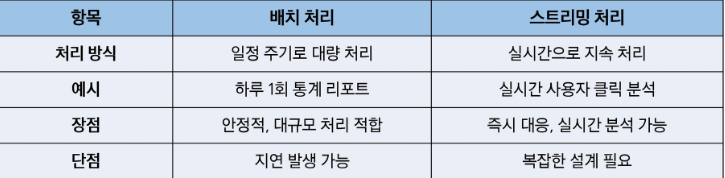
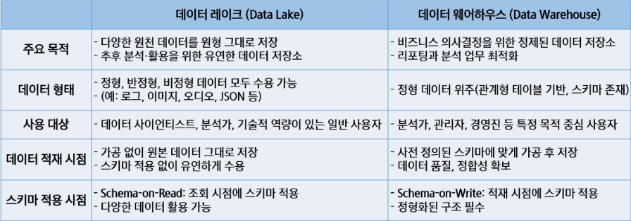
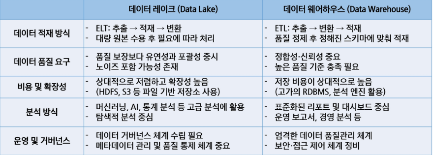
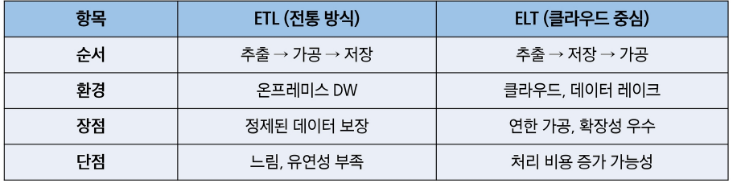

# 데이터?
- 2010년대 이후를 대표 하는 키워드
- 대규모로 수집된 원시 자료
- 나중에 의미 부여

# 데이터가 중요해진 이유
- 빅데이터 : 데이터의 양(Volume), 다양성(Variety), 증가 속도(Velocity) 향상 + 신뢰성(Veracity), 가치(value)
- 데이터를 수집, 가공, 활용할 수 있는 기술의 대두 -> 데이터 파이프라인

# 데이터는 어디에 쓰이나
- 비즈니스 리더들의 의사 결정
- 데이터를 통한 서비스/제품 강화

# 데이터 엔지니어의 주요 활동
- 주요 역할
    - 데이터를 안정적으로 수집하고 가공하여 전달
    - 분석과 모델링이 가능하도록 데이터 흐름을 자동화
    - 신뢰성 있고 재사용 가능한 파이프라인 구축

- 주로 하는 일
    - 다양한 시스템에서 데이터 수집
    - 정제 및 변환(ETL/ELT 설계)

# 데이터 파이프라인
- 데이터를 추출하고 정제하고 저장, 분석, 시각화하는 일련의 자동화 과정

# OLAP 와 OLTP
- OLTP
    - 운영 데이터 처리 시스템
    - 실시간 트랜잭션(주문, 결제, 예약) 처리
    - 행(Row) 단위 저장 구조
    - 빠른 입력, 수정, 삭제에 최적화

- OLAP
    - 분석 데이터 처리 시스템
    - OLTP 등에서 수집된 데이터를 기반으로 통계, 리포트 분석
    - OLAP 시스템은 분석 성능을 위해 컬럼 기반 저장 구조를 사용하는 경우가 많음
    - 집계, 요약, 예측 분석에 최적화

# ETL
- 데이터를 가공한 후 저장, 전통적인 방식
- 추출 -> 가공 -> 저장

# 데이터 처리 방식 - 배치와 스트리밍
- 배치 처리 방식
    - 데이터를 모아서 한 번에 처리하는 방식
    - 주로 하루 1회, 또는 시간 단위로 처리가 이뤄짐.
    - 정확성과 대량 처리에 적합함

- 데이터 스트리밍 처리 방식
    - 데이터가 들어오는 즉시 실시간 처리하는 방식
    - 빠르게 변화하는 데이터에 즉시 반응 가능
    - 실시간 분석과 대응이 가능

# 데이터 파이프라인의 기본 구조
- 자동화 된 데이터 흐름
    - 데이터 소스 -> 수집 -> 가공 -> 저장 -> 분석/제공

# 데이터 저장소의 중요성
- 저장소는 분석을 위한 인프라
    - 데이터를 단순히 저장하는 것이 아닌 분석, 활용을 위한 설계가 필요
    - 저장소에 따라 처리 방식과 유연성이 달라짐
    - 파이프라인에서 중요한 핵심 축

# 데이터 저장소
- 종류
    - 데이터 웨어하우스 : 정형 데이터를 저장하는 구조, 기본 저장구조
    - 데이터 레이크 : 원본 데이터를 저장하는 구조, 수집 후 재가공하여 활용
    - 데이터 마드 : 특정한 목적을 위해 데이터 웨어하우스의 내용을 다시 추출하여 저장

# 데이터 웨어하우스의 구성
- 정형 데이터 중심
- 스키마 사전 정의
- ETL 기반의 처리 방식

# 데이터 레이크의 구성
- DW의 구조적 질서에 유연성을 결합
- 분석, 모델링, BI 모두 대응하는 형태

# 데이터 레이크
- 데이터 웨어하우스와의 차이
    - 데이터 웨어하우스는 최종 사용자가 보고 싶은 관점별 데이터 구성을 위해 원천 DB로부터 데이터를 수집
    - 스키마 관리와 품질 관리를 통해 리포트를 제공하는 시스템
    - DW는 데이터 구조가 이미 결정되어 엄격한 스키마 관리가 필요하고 한 번 구축 시 변경이 어려움

# ETL과 ELT의 차이

# 데이터 수집 도구
- Kafka
    - 분산 메시지 큐 시스템
    - 대용량 데이터를 빠르고 안정적으로 전달
    - 실시간 스트리밍 수집에 강점

# 데이터 처리(가공) 도구
- Spark
    - 대규모 배치 처리 프레임워크
    - ETL/머신러닝 통합 가능
    - DAG 기반 처리로 안정성과 확장성 확보
- Flink
    - 스트리밍 처리 전문 프레임워크
    - 이벤트 기반 실시간 분석에 최적화
    - 상태 기반 연산 및 복잡한 처리 가능

# 데이터 저장 도구
- REBMS(PostgreSQL, Oracle,등)
    - 고급 기능을 지원하는 오픈소스 관계형 데이터 베이스
    - 정형 데이터 저장에 적합
- Elasticsearch
    - 실시간 검색과 분석에 강력한 NoSQL DB
    - 로그, 텍스트 분석, 모니터링 등 다양한 사용처
- Hadoop (HDFS)
    - 대용량 비정형 데이터 저장용 HDFS 기반 저장소
    - 정형,비정형 데이터 통합 저장 가능

# 데이터 모니터링 및 워크플로우 관리 도구
- Airflow
    - 워크플로우 스케쥴러(DAG 기반)
    - 파이프라인의 각 단계를 자동화 및 모니터링
- Grafana
    - 실시간 시각화 대시보드
    - 다양한 데이터 소스와 연결 가능(Prometheus, Elasticsearch 등)
- Prometheus
    - 시계열 기반 모니터링 도구
    - 지표 수집, 알림, 시각화 연동 기능 제공

# 데이터 레이크 분석 도구
- BI(Business Intelligence) / OLAP(Online Analytical Processing)
    - 데이터를 시각적으로 분석하거나 리포트를 만들기 위한 도구
    - 엑셀의 Pivot 기능 또는 시각화 기능과 같은 기능을 좀 더 전문적으로 다루는 도구
    - 원래 데이터 웨어하우스의 등장과 함께 같이 쓰이는 도구였으나, 데이터 레이크도 연결 가능
    - 라이선스 비용이 높은 편

# 데이터 레이크하우스
- 구성
    - 정형 + 비정형 데이터 모두 저장
    - 스키마는 나중에 적용(schema-on-read)
    - 대용량 로그/센서 데이터 수용 가능

# 아키텍처 설계
- 데이터 엔지니어 관점에서 데이터 아키텍처 주 관심사는 파이프라인 설계
- 데이터 수집부터 분석/시각화 환경까지 데이터를 견고하게 전달할 수 있는 아키텍처 설계를 목표로 함

# 파이프라인 설계
- 파이프라인 설계는 환경마다 다르기에 정답은 없다.
- (온프레미스 vs 클라우드)
- 요구사항에 따라 각양각색으로 구현 가능하나, 실시간 수집이 필요한지 여부에 따라 파이프라인 설계 구분 가능
- 람다 아키텍처 & 카파 아키텍처
    - 실시간 수집이 필요한 경우 참조할 수 있는 아키텍처가 존재한다
    - 대표적으로 람다(Lambda) 아키텍처와 카파(Kappa) 아키텍처가 존재

## 람다 아키텍처
- 2011년에 제시된 아키텍처
- 실시간 수집이 필요한 경우 배치 처리와 스트림 처리를 모두 이용가능

## Serving Layer
- 배치 Layer에 저장된 데이터를 빠르게 보여주기 위한 서비스 계층
- 사용자가 쿼리 할 수 있도록 함
- 필요에 따라 스피드 Layer에 있는 데이터를 결합하기도 함

## 배치 Layer & 스트림 Layer
- 배치 Layer에 저장된 데이터가 특정 기준 데이터라면 스피드 Layer에는 당일 데이터가 저장/정제하여 저장하는 공간
- 배치 Layer에서 테이블 갱신이 완료되면 스트림 Layer는 그 이후 데이터부터 저장 및 정제
- 람다 아키텍처는 컨셉만 제공

## 카파 아키텍처
- 배치 layer를 제거하되 배치 Layer에서 하던 일을 모두 스피드 layer에서 수행하는 구조(전처리 후 필요한 테이블로 재구성)
- 데이터 소스는 주로 메시지 큐를 의미
- 메시지 큐에는 여러 솔루션이 존재하지만 Kafka를 개발한 Jay Kreps가 만든 카파 아키텍처에서 데이터 소스는 사실상 kafka의 Cluster를 의미
- 카파 아키텍처에서 대표적으로 데이터는 Kafka로 수집함
- 그러나 일반적으로 배치 파이프라인도 많이 활용

## 람다 아키텍처나 카파 아키텍처만 가능?
- 구조화된 아키텍처는 참고를 위한 아키텍처일 뿐 모든 데이터를 해당 아키텍처 기반의 파이프라인으로 만들 필요는
- 아키텍처 수용 여부는 파이프라인마다 데이터의 활용 요건으로 결정
- 데이터 활용 요건을 분석 후 아키텍처를 따를지 어떤 데이터 뷰를 활용할 지 결정

