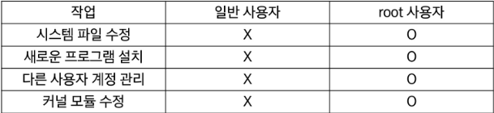
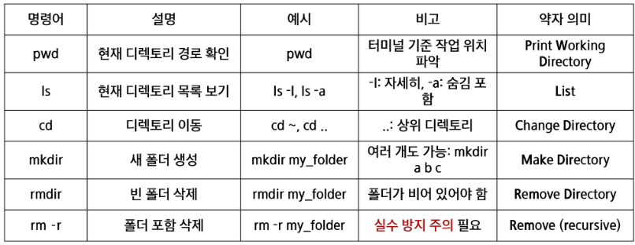
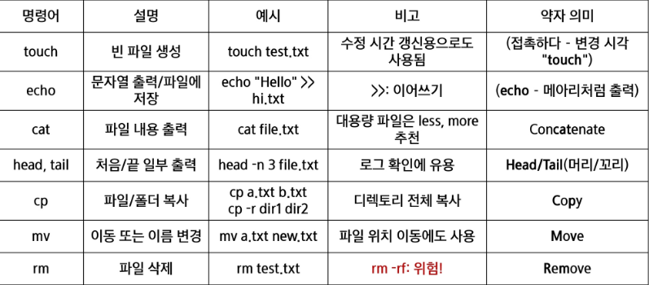
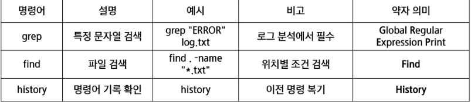
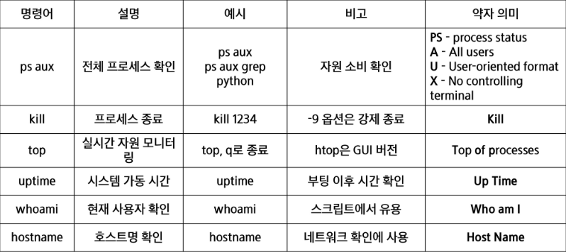
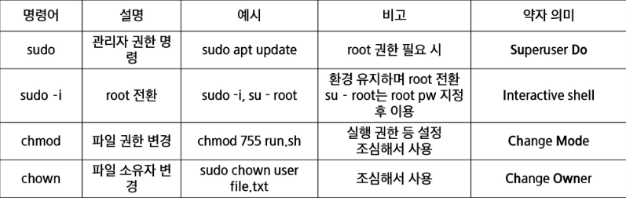
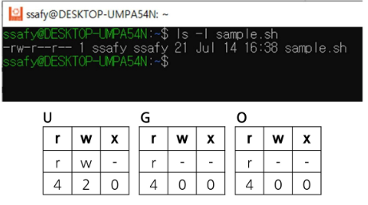
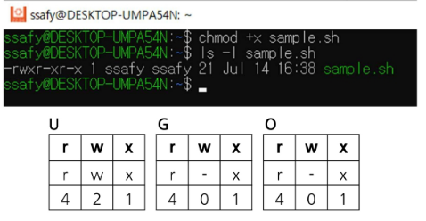
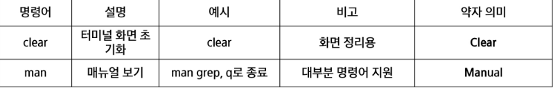

# root 사용자란
- 최고 권한을 가진 계정
    - 시스템의 모든 파일, 설정, 사용자 계정 등에 제약 없이 접근 가능
    - Windows의 Administrator에 대응되는 개념
    
- 주의점
    - 실수로 중요한 시스템 파일 삭제 가능
    - 잘못된 명령어로 OS 자체를 망가뜨릴 위험
    - 외부 공격자가 root 권한을 얻으면 시스템 전체 장악 가능
    - 그래서 보통은 sudo 명령어로 필요한 작업만 root 권한을 임시로 위임받아 실행함

# root 사용자 권한 전환
- sudo -i
- 현재 계정에서의 비밀번호 입력
- 권한 확인 후 exit를 통해 기존 계정으로 복귀

## 파일 및 디렉토리 관리

## 파일 생성, 편집, 복사, 삭제

## 검색과 필터링

## 시스템 정보 및 프로세스

## 사용자 권한 및 보안

## chmod(Change Mode)
- 리눅스 권한 구조
    - 리눅스에서는 각 파일/디렉토리에 대해 다음 3가지 주체에 권한을 따로 설정할 수 있다
- 주체
    - u(user) : 파일의 소유자
    - g(group) : 파일이 속한 그룹
    - o(other) : 그 외 사용자
- 권한
    - r(read) : read(내용 보기 가능)
    - w(write) : write(수정, 삭제 가능)
    - x(excute) : execute(실행 가능, 디렉토리 접근 포함)

- 샘플 sh 파일 만들고 간단하게 확인
    - touch smaple.sh
    - echo 'echo "hello, Linux!"' > sample.sh
    - cat sample.sh

    - smaple.sh는 6 4 4의 권한을 가짐
    - 사용자는 읽기 + 쓰기
    - 그룹은 읽기 전용
    - 기타 사용자도 읽기 전용

    - chmod +x smaple.sh
    - 사용자는 sample.sh에 실행 권한을 추가해서 755의 권함을 주게 됨

## CLI 환경 관련 유용 명령
