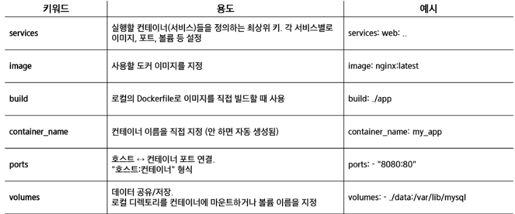
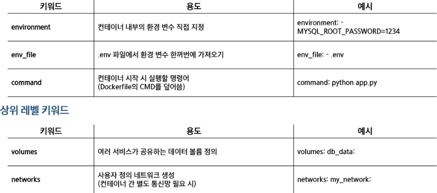
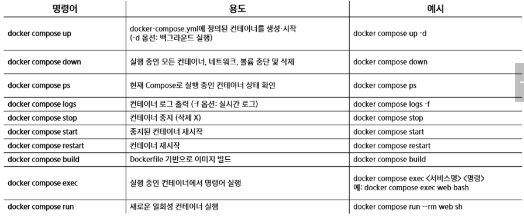

# Docker Compose
- Docker Compose는 여러 컨테이너를 하나의 프로젝트처럼 관리할 수 있게 해주는 도구
- docker-compose.yml 파일에 정의된 내용을 바탕으로 한번에 컨테이너들을 실행

## docker-compose.yml 구조
- services : 컨테이너 목록
- image : 사용할 도커 이미지
- ports : 호스트와 컨테이너의 포트 매핑

## Docker compose.명령어
- docker compose up -d  #백그라운 실행
- docker compose ps #실행 중인 서비스 확인
- docker compose down #컨테이너, 네트워크 정리

# 자주 쓰이는 docker-compose.yml 문법

# Docker Compose 네트워크
- 같은 Compose 파일 내 네트워크
    - docker compose up을 실행하면 자동으로 프로젝트 이름 기반의 네트워크가 생성
    - 같은 docker-compose.yml 내 서비스들은 동일 네트워크를 공유하므로 통신 가능
    - 서비스명으로 접근 권장
        - Docker가 자동으로 DNS를 관리하므로, db서비스 -> IP보다 db라는 이름으로 접근하는 것이 일반적이고 안전(IP는 컨테이너 재시작 시 바뀔 수 있음)
- 다른 Compose 프로젝트 간 네트워크
    - 기본적으로 프로젝트 간 네트워크는 분리되어 서로 통신할 수 없음
    - 하지만 명시적으로 같은 사용자 정의 네트워크를 지정하면 서로 통신 가능
    - 두 개의 서로 다른 docker-compose.yml에서 동일한 미리 만든 외부 브리지 네트워크에 external: true 옵션을 사용하면 IP/서비스명 공유

- 서비스명으로 접근할 때는 동일 네트워크 내에서만 가능하고, 외부 네트워크 간 통신을 위해선 명시적으로 네트워크를 설정 필요

