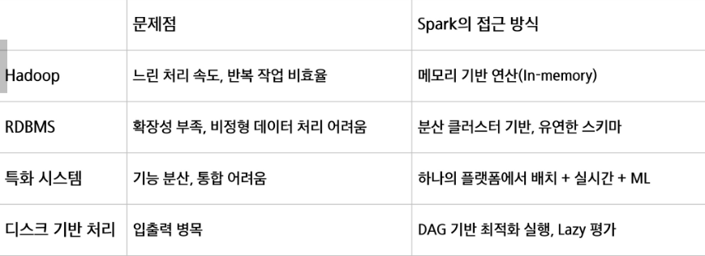

# Spark의 탄생 배경과 설게 목적
- 기존 Hadoop MapReduce는 느린 속도와 반복 작업의 비효율성이라는 구조적 한계 존재
- 특히 머신러닝, 스트리밍 분석처럼 반복적이고 실시간성이 요구되는 작업에 부적합
- Spark는 UC Berkeley AMP Lab에서 이러한 문제를 해결하고자 개발됨
- 2009년 개발 시작 -> 2010년 오픈소스 공개 -> 2014년 Apache 프로젝트로 채택

## Hadoop ecosystem
- 하둡의 코어 프로젝트는 HDFS, MapReduce, YARN이지만 이들의 역할을 수행해내는 다양한 서브 프로젝트들로 구성된 환경
- 분석과 처리를 Spark로 활용하는 경우 증가

# Spark가 기존 기술의 한계를 어떻게 극복했는가

## Spark 사용 이유
- 반복 연산에서 Hadoop MapReduce보다 빠른 처리 성능
- 메모리 기반의 데이터 처리로 빠른 속도
- Hadoop과의 유연한 연동성
- RDD의 계보(lineage)를 기반으로 장애 발생 시 연산을 자동으로 재실행하여 복구

# Spark의 설게 철학
- 속도
    - 메모리 기반 연산(In-Memory Computation)으로 디스크 I/O 최소화
    - DAG 기반 스케줄링으로 병령 처리 최적화
    - Tungsten 엔진을 통한 코드 생성 최적화

- 사용 편리성
    - 단일 PC와 클러스터 간 코드 차이가 최소화된 추상화 구조
    - RDD -> DataFrame -> Dataset의 계층적 API 제공
    - Scala, Python, Java, R 등 다중 언어 지원

- 모듈성
    - SparkSQL, Streaming, MLlib, GraphX 등 다양한 워크로드를 하나의 엔진에서 처리
    - 별도의 시스템(Hive, Storm, Mahout 등) 통합 불필요

- 확장성
    - 다양한 데이터 소스(HDFS, Cassandra, MongoDB, RDBMS, S3 등) 연동
    - 여러 파일 포맷(csv, parquet 등) 지원
    - 수많은 서드파티 패키지와 통합 가능

# Spark의 주요 컴포넌트
- 모든 컴포넌트는 Spark Core 위에서 실행되며, 공통된 실행 엔진 및 스케줄러 공유
- Spark Core : 핵심 실행 플랫폼
- Spark SQL : 구조적 데이터 처리 및 SQL 기반 쿼리 실행
- Spark Streaming : 실시간 데이터 분석을 위한 스트리밍 처리(마이크로 배치 방식)
- MLlib : 머신러닝 알고리즘 라이브러리(분류, 회귀, 군집 등)
- GraphX : 그래프 기반 데이터 처리와 분석 지원*(PageRank 등)

# Spark 활용 시 주의점
- 엄밀한 실시간처리 불가(Micro-batch 기반)
- 작은 데이터 파일 처리의 비효율성
- 자체 파일 관리 시스템 부재 (HDFS, S3 등 사용)
- 높은 메모리 비용

# 애플리케이션 구성 요소
1. 클러스터 매니저(Cluster manager)
    - 애플리케이션의 리소스 관리
    - 드라이버가 요청한 실행기 프로세스 시작
    - 실행 중인 프로세스를 중지하거나 재시작
    - 실행자 프로세스가 사용할 수 있는 최대 CPU 코어 개수 제한
- 종류
    - Standalone
    - Hadoop Yarn
    - Kubernetes
2. 드라이버(Driver)
    - 스파크 애플리케이션의 실행을 관장하고 모니터링
    - 클러스터 매니저에 메모리 및 CPU 리소스를 요청
    - 애플리케이션 로직을 스테이지와 태스크로 분할
    - 여러 실행자에 태스크를 전달
    - 테스트 실행 결과 수집
    - 1개의 스파크 애플리케이션에는 1개의 드라이버만 존재
    - 드라이버 프로세스가 어디에 있는지에 따라, 스파크에는 크게 두 가지 모드가 존재
        - 클러스터 모드 - 드라이버가 클러스터 내의 특정 노드에 존재
        - 클라이언트 모드 - 드라이버가 클러스터 외부에 존재
3. 실행기(Executor)
    - 드라이버로부터 전달받은 태스크를 실행하는 프로세스
        - 스파크 드라이버가 요청한 태스크들을 받아서 실행하고, 그 결과를 드라이버로 반환
        - 각 프로세스는 드라이버가 요청한 태스크들을 여러 태스크 슬롯(스레드)에서 병렬로 실행
        - JVM 프로세스
4. 스파크 세션(Session)
    - 스파크 기능(DataFrame, SQL등)을 사용하기 위한 진입점
        - Spark Core 기능들과 상호 작용할 수 있는 진입점 제공
        - API로 프로그래밍을 할 수 있게 해주는 객체
        - spark-shell에서 기본적으로 제공
        - 스파크 애플리케이션에서는 사용자가 SparkSession 객체를 생성해 사용해야 함
5. 잡(Job)
    - 사용자가 실행한 액션(collect(), count() 등)에 의해 생성되는 작업 단위
        - 스파크 액션에 대한 응답으로 생성되는 여러 태스크로 이루어진 병렬 연산
6. 스테이지(Stage)
    - 잡(Job)을 셔플(데이터 이동) 기준으로 나눈 실행 단위
        - 스파크 각 잡은 스테이지라 불리는 서로 의존성을 가지는 다수의 태스크 모음으로 나뉨
7. 태스크(task)
    - 스테이지를 구성하는 실제 실행 단위
        - 스파크 각 잡별 실행기로 보내지는 작업 할당의 가장 기본적인 단위
        - 개별 task slot에 할당 되고, 데이터의 개별 파티션을 가지고 작업

# 스파크 연산의 종류
- 스파크 연산은 크게 트랜스포메이션(Transformation), 액션(Action)으로 구별

## Transformation
- immutable(불변)이 원본 데이터를 수정하지 않고, 하나의 RDD나 Dataframe을 새로운 RDD나 Dataframe으로 변형
- (input, output)타입 : (RDD,RDD),(DataFrame,DataFrame)인 연산
    - map(), filter(), flatMap(),select(), groupby(), orderby()
- narrow, Wide Transformation 존재

## Narrow transformation
- input : 1개의 파티션
- output : 1개의 파티션
    - 파티션 간의 데이터 교환이 발생하지 않음
    - ex) filter(), map(), coalesce()

## Wide transformation
- 연산 시 파티션끼리 데이터 교환 발생
    - ex) groupby(), orderby(), sortByKey(), reduceByKey()
    - 단, join의 경우 두 부모 RDD/Dataframe이 어떻게 파티셔닝 되어 있냐에 따라 narrow일 수도 wide일 수도 있음

## Action
- immutable(불변)인 인풋에 대해, Side effect(부수 효과)를 포함하고, 아웃풋이 RDD 혹은 Dataframe이 아닌 연산
    - count() -> 아웃풋 : int
    - collect() -> 아웃풋 : array
    - save() -> 아웃풋 : void

## Lazy evaluation
- 모든 transformation은 즉시 계산되지 않음
- 계보(lineage)라 불리는 형태로 기록
- transformation이 실제 계산되는 시험은 action이 실행되는 시점
- action이 실행될 때, 그 전까지 기록된 모든 transformation들의 지연 연산이 수행됨

- 장점
    - 스파크가 연산 쿼리를 분석하고, 어디를 최적화할지 파악하여, 실행 계획 최적화가 가능(eager evaluation이라면, 즉시 연산이 수행되기 때문에 최적화 여지가 없음)
    - 장애에 대한 데이터 내구성을 제공
    - 장애 발생 시, 스파크는 기록된 lineage를 재실행 하는 것만으로 원래 상태를 재생성 할 수 있음