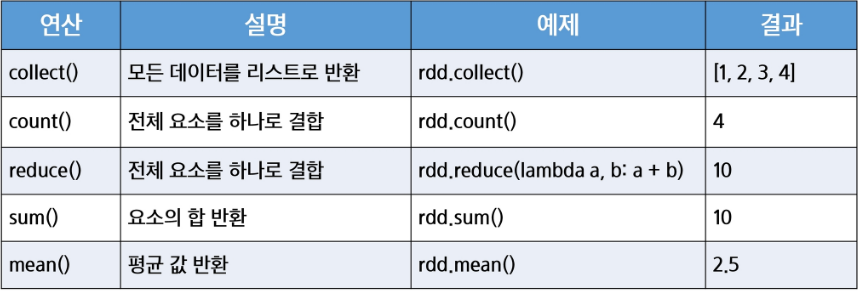

# 기존의 메모리 데이터를 RDD로 변환하는 방법
- Python의 리스트(list)나 Scala의 컬렉션(Collection)을 RDD로 변환 가능
- 이 방법은 주로 테스트나 작은 데이터 셋을 다룰 때 사용

# 외부파일(CSV, JSON 등)에서 RDD 생성 방법
- 실무에서는 보통 파일이나 DB에서 데이터 불러와야함
- sc.textFile("파일 경로"), spark.read.format("jdbc").option(...)형태를 사용 하여 외부 데이터를 RDD로 변환 가능

# Parallelize()
1. 기존 메모리 데이터를 Spark의 RDD로 변환하는 역할
2. parallelize()는 메모리에 있는 데이터를 Spark 클러스터로 보낼 때 사용 -> 데이터가 클 경우 비효율적일 수 있어 소규모 데이터분석에 주로 이용

# sc.textFile()
1. 외부 파일에서 데이터를 직접 읽어와 RDD로 변환하는 역할 -> 일반적인 텍스트 파일 (CSV, 로그 파일 등), S3 -> 저장소에서 데이터 로드 HBase, Cassandra (C)* -> NoSQL 데이터베이스에서 읽기 등

# ACTIONS
- 변환된 RDD 데이터를 메모리로 가져오거나, 저장하거나, 집계하는 연산
