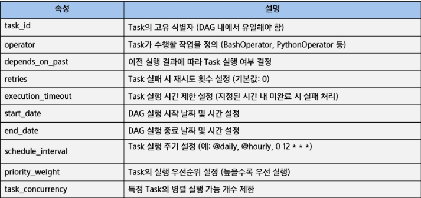

# DAG란?
- Airflow에서 작업(Task)들의 실행 순서를 정의하는 그래프
- 방향성(Directed) -> 작업이 정해진 순서로 실행됨
- 비순환(Acyclic) -> 순환(Loop) 구조가 없어 무한 실행 방지

# Task란?
- Task는 워크플로우를 구성하는 개별 작업 단위
- ETL, 데이터 변환, 머신러닝 모델 실행, 파일 이동 등의 작업을 수행할 수 있음
- 워크플로우를 구성하는 기본 요소

## Task의 주요 속성
