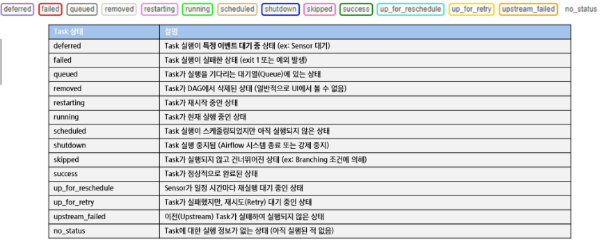
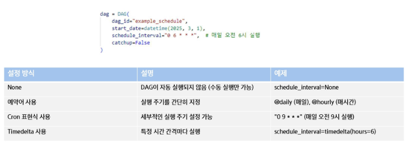

# DAG 실행
- 자동 실행 : DAG에 설정된 스케쥴(Interval, cron 등)에 따라 실행
- 수동 실행 : Web UI 또는 CLI(Command Line Interface)를 통해 즉시 실행
- 이벤트 기반 실행 : 특정 트리거(예:API요청, 파일 업로드 등)로 실행

# DAG 및 Task 실행 상태 종류
- Airflow에서는 Task의 실행 상태를 다양한 값으로 나타냄

# Airflow 스케줄링
- Schedule : DAG를 실행하는 주기를 설정하는 방식
- Schedule interval : DAG이 실행되는 시간 간격을 결정하는 속성
