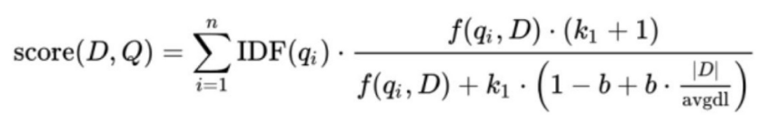
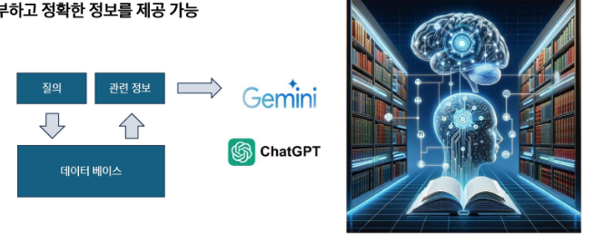

<!-- ---------------------- EDA ---------------------- -->
# EDA(Exploratory Data Analysis)
- 데이터를 탐색하고 가설을 세우고 증명하는 과정, 이해하고 특징을 찾아내는 과정
- 데이터 종류, 사용 모델에 따라 EDA 방향성이 다양함

# 탐색적 데이터 분석(EDA)
- 데이터의 본질을 이해하고, 데이터에 숨겨진 패턴을 찾기 위해 데이터를 시각화하고 요약하는 과정
- 데이터 시각화(Matplotlib, seaborn, ...)
- 가정에 얽매이지 않음(고전적 통계학에서는 주로 가정을 세움)
- 이상치 탐지(특이한 값)
- 기술 통계 수행(고전적 통계와 비슷)

# EDA 과정에서 파악할 요소
- 데이터 사이즈는 어느 정도인지
- 학습 데이터와 테스트 데이터는 어떻게 분리가 되어있는지
- 결측값은 어느 정도 인지
- 라벨이 있는 데이터라면 분포는 어떻게 되어있는지
- 데이터의 특이점이 있는지

# 수치형 데이터
- 연속형 데이터(무한한 값을 가질 수 있는 수치데이터)
    - 풍속, 지속시간 등

- 이산형 데이터(특정한 정수값을 가질 수 있는 수치데이터)
    - 사건의 발생 빈도 등

# 범주형 데이터
- 명목형 데이터(순서의 의미가 없는 범주데이터)
    - TV 스크린 종류(플라즈마, LCD, LED 등)
    - 도시명(대전,부산,서울 등)

- 순위형 데이터(순서의 의미가 있는 범주데이터)
    - 수치로 나타낼 수 있는 평점(1,2,3,4,5점 등)
    - 선호도(좋다, 중립, 싫다)

## 왜 굳이 데이터의 종류를 분류해야할까?
- 데이터를 분석하고 예측을 모델링할 때, 시각화, 해석, 모델 결정등에 데이터의 종류가 중요한 역할을 하기 때문

# 테이블 데이터
- 용어정리
    - DataFrame : 통계와 머신러닝 모델에서 가장 기본이 되는 테이블 형태의 데이터 구조
    - Feature : 일반적으로 테이블의 각 열을 의미
    - Output : 데이터 과학 프로젝트의 목표는 대부분은 어떤 결과를 예측하는 것에 있음. 그 결과를 예측하기 위해 피처를 사용
    - Record : 일반적으로 테이블에서 하나의 행을 의미

# 테이블 데이터가 아닌 데이터 구조
- 시계열 데이터
    - 동일한 변수 안에 연속적인 측정값을 갖는 데이터
    - ex : 주가, 기온, 센서 ....
- 공간데이터
    - 지도 제작과 위치 정보 분석에 사용되는 공간 데이터의 경우 테이블 데이터보다 좀 더 복잡하고 다양함
        - 객체를 표현할 때에는, 공간 좌표가 데이터의 중심이 됨
        - 필드 정보는 공간을 나타내는 작은 단위들과 적당한 측정 기준 값에 중점을 둠
- 그래프 데이터
    - 물리적 관계, 사회적 관계 그리고 다소 추상적인 관계들을 표현하기 위해 사용
    - 노드 연결 형태
        - 예시 : 페이스북이나 링크드인 값은 소셜네트워크의 그래프
        - 예시 : 도로로 연결된 물류 중심지

<!-- ----------------웹 크롤링------------------------- -->
# 웹 크롤링이란?
- Web(거미줄) + Crawling(기어다니다)
- 크롤링
    - 인터넷 상의 웹 페이지를 자동으로 탐색하고 데이터를 수집하는 기술
- 스크래핑
    - 특정 웹페이지에서 원하는 데이터(텍스트, 이미지, 표 등)를 추출하는 과정
    
# 웹 크롤링의 특징
- 자동화
- 대량 데이터 수집
- 구조화된 데이터 추출

# 웹 데이터 수집 방법
- 웹 페이지를 가져와서 필요한 정보만 추출하기(스크래핑)
- WebDriver를 이용해 웹 브라우저 자동화하기(스크래핑 or 크롤링)
- 제공된 OpenAPI를 이용해 실시간으로 데이터 가져오기

# 웹 페이지에서 데이터 추출
- 웹페이지는 HTML(Hyper text markup language)을 중심으로 이루어져 있음
- 원하는 주소의 웹 페이지로 들어가 HTML 내용을 가져오고, 그 안에서 원하는 데이터가 어디 있는지 가져오는직업(parsing)
- Python에는 정적 페이지에서는 BeautifulSoup 라이브러리 주로 사용

# WebDriver로 웹 브라우저 자동화
- 크롬, 파이어폭스, IE등의 웹 브라우저에서 클릭, 텍스트 입력 등의 행동을 코드로 제어 할 수 있게끔 만든 브라우저를 WebDriver라고 함
- 로그인이 필요한 서비스 등 단순 URL만으로는 접속할 수 없는 세션 유지가 필요한 작업이나, 옵션이나 드롭다운 메뉴를 클릭해야함 데이터를 얻을 수 있는 작업에 필요함
    - 꼭 크롤링이 아니더라도, 웹 브라우저의 행동을 자동화하는 다른 작업(게시판에 자동 글쓰기, 새 메일 자동 읽기 등)
- Python에서는 Selenium 라이브러리를 사용함

# Selenium
- 브라우저를 조작하기 위한 여러 역할의 도구들이 모여 있는 프레임워크
- 조작을 가능하게 만드는 핵심
    - 요소(Element)를 정확히 찾고 적절한 타이밍에 행동(Action)을 주는 것

# Selenium이 필요한 이유
- BeautifulSoup은 결국 HTML을 가져와서 파싱하는 역할일 뿐
- Selenium의 핵심은 결국 웹 브라우저를 컨트롤할 수 있다는 것
- 브라우저를 코드로 제어
- 화면에서 보이는 내용이라면 모두 컨트롤할 수 있음

# BeautifulSoup
- BeautifulSoup란
    - HTML 및 XML 문서를 구문 분석하기 위한 Python 패키지로, 데이터를 쉽게 추출할 수 있도록 도와줌
    - 웹 브라우저가 하는 일과 비슷하게, HTML 소스를 트리 형태로 해석한 뒤 접근 할 수 있음
- Task, 학식 정보 가져오기
    - 구글에 '서울대학교 식단'을 검색하면, 생활협동조합 식단 페이지에 접속
    - 이름 get으로 요청한 뒤, 응답 텍스트를 BeautifulSoup의 인자로 넣고 실행

# BeautifulSoup 활용
- 겉보기엔 별 변화가 없지만, 현재 bs 객체에는 이미 HTML의 정보가 BeautifulSoup를 통해 해석되어 있다.
- 학생회관식당의 점심 메뉴가 HTML 코드 상에서 어디에 위치하는지 알기 위해, 요소 검사를 실행
- DOM을 잘 확인하는 것이 가장 중요
- 개발자도구로 코드를 보면, 메뉴 전체는 `<table class="menu-table">`
- 요일/식당 별 메뉴는 `<tbody>` 안의 여러 `<tr>`로 구성되어 있음
- 각 `<tr>`이 식당 1곳을 의미

<!-- --------------인공지능 기본------------------------- -->
# 인공지능(AI) vs 머신러닝(ML) vs 딥러닝(DL)
1. 인공지능 : 규칙 기반의 알고리즘
2. 머신러닝 : 데이터 기반의 학습, 결정트리, 선형회귀, 퍼셉트론, SVM
3. 딥러닝 : CNN, RNN, GAN, 트랜스포머..

# 피처 엔지니어링이란
- 모델이 더 좋은 예측을 할 수 있도록 데이터를 가공하는 과정
- 데이터를 단순히 수집하는 것보다 적절한 피처(Feature, 변수)를 만드는 것이 성능 향상에 중요

# 피처 엔지니어링 필요성
- 원본 데이터는 모델이 바로 이해하기 어려운 형태일 수 있음
- 좋은 피처를 만들면 복잡한 모델 없이도 높은 성능을 낼 수 있음
- 불필요한 변수를 제거하면 연산 속도가 빨라지고 해석력이 향상됨

# 피처 선택(Feature Selection)
- 모델 성능에 중요한 변수만 선택하고 불필요한 변수 제거
- 방법 :
    - 상관계수 분석 -> 상관관계가 높은 변수 제거
    - 분산 기반 선택 -> 변화가 거의 없는 변수 제거
    - Recursive Feature Elimination(REF) -> 모델 성능에 가장 중요한 변수 선택

# 피처 생성(Feature Creation)
- 기존 데이터를 활용하여 새로운 변수를 만드는 과정
- 예시 :
    - 날짜 데이터 -> "요일", "주말 여부", "계절" 변수 추가
    - 판매 데이터 -> "가격" X "판매량"으로 매출 변수 생성

# 피처 변환(Feature Transformation)
- 모델이 데이터를 더 잘 학습할 수 있도록 변형
- 방법 :
    - 정규화(Normalization) : 값의 범위를 [0,1]로 조정
    - 표준화(Standardization) : 평균 0, 표준편차 1로 조정
    - 로그변환(Log Transformation) : 데이터 분포를 정규분포에 가깝게 변형

# 범주형 데이터 인코딩(Categorical Encoding)
- 문자 데이터를 숫자로 변환하여 모델이 이해할 수 있도록 함
- 방법 : 
    - 원-핫 인코딩(One-Hot Encoding) : 카테고리를 0과 1로 변환
    - 라벨 인코딩(Label Encoding) : 카테고리를 숫자로 변환(예: "Red" -> 1, "Blue" -> 2)

# 결측값 처리(Handling Missing Values)
- 데이터에서 비어있는 값(결측치)을 처리하는 과정
- 방법 :
    - 삭제 : 결측치가 적으면 해당 행 제거
    - 대체 : 평균, 중앙값, 최빈값으로 채우기
    - 예측 모델 사용 : 머신러닝을 활용하여 결측값 예측

# 이상치 처리(Outlier Handling)
- 극단적인 값을 감지하고 처리하는 과정
- 방법 :
    - Z-score, IQR(사분위 범위) 기반 이상치 제거
    - 로그 변환으로 이상치 영향을 줄이기

# 머신러닝의 분류
- Supervised Learning(지도 학습)
- Unsupervised Learning(비지도 학습)
- Reinforcement Learning(강화 학습)

## Supervised Learning(지도 학습)
- 정답을 주고 학습 시킴

## 컴퓨터 비전에서의 Supervised Learning(지도학습)
- 객체 위치 지정 및 탐지
    - x = raw pixeld of the Image, y = the bounding boxes

## 자연어 처리에서의 Supervised Learning(지도학습)
- 기계 번역

## Unsupervised Learning(비지도 학습)
- 데이터셋에 라벨이 없음 : x1, ... , xn
- 목표(모호하게 제시됨) : 데이터에서 흥미로운 구조를 발견하는 것

## Self-Supervised Learning 자기지도학습
- Large Language Model
    - 대규모 언어 데이터셋을 통해 학습된 기계 학습 모델
    - 다양한 목적으로 활용 가능
- 자기 지도 학습
    - 지도 학습의 단점인 정답 데이터에 대한 한계를 극복 - 정답이 없는 데이터도 자체 데이터로 학습
    - 사전 학습(Pre-training)과 미세 조정(Fine-tuning)단계로 진행

# Reinforcement Learning(강화 학습)
- 순차적인 결정을 내리는 학습
    - 알고리즘은 데이터를 상호작용적으로 수집할 수 있음

<!-- -----------------------모델 성능평가--------------------------- -->
# Overfitting vs Underfitting
- Overfitting(과적합)
    - 모델이 학습 데이터에 지나치게 적합하여, 복잡한 패턴까지 모두 학습
    - 학습 데이터에서는 높은 성능, 하지만 새로운 데이터에서는 성능이 저하
- Underfitting(과소적합)
    - 모델이 충분히 학습되지 않아 중요한 패턴조차 학습하지 못함
    - 학습 데이터와 테스트 데이터 모두에서 성능 저조

# 평가(Evaluation)
- 실제값과 모델에 의해 예측된 값을 비교하여 두 값의 차이(오차)를 구하는 것
- (실제 값 - 예측값) = 0 이면, 오차가 없는 것으로 모델이 100% 성능을 보임
- But 성능이 100%인 모델은 현실적으로 힘들기 때문에, 오차를 구하여 어느 정도까지 오차를 허용할지 결정
- -> 과적합(Overfitting)을 방지하고 최적의 모델을 찾기 위해 실시

- 모델링의 목적 또는 목표 변수의 유형에 따라 다른 평가지표 사용

# 회귀 모델 평가 방법
- 하나의 목표를 가지고 다양한 회귀 모델을 만들어 테스트
- 그 중 어떤 모델이 가장 나은 모델인지 판단할 때 모델 평가지표 사용
- 실제 데이터와 예측 결과 데이터가 얼마나 비슷한지에 기반하지만, 단순하게 이것만 가지고 판단하기에는 무리가 있음
    - 평균 절대 오차(MAE, Mean Absolute Error)
    - 평균 절대 백분율 오차(MAPE, Mean Absolute Percentage Error)
    - 평균 제곱 오차(MSE, Mean Squared Error)
    - 평균 제곱근 오차(RMSE, Root Mean Squared Error)
    - 결정 계수(r^2 Scire)

## MAE(Mean Absolute Error)
- 실제 정답 값과 예측 값의 차이를 절대값으로 변환한 뒤 합산하여 평균을 구함
- 이상치를 고려하지 않는 경우에 주로 사용
- 값이 낮을수록 좋은 모델
- 실제 정답보다 낮게 예측했는지, 높게 했는지를 파악이 어려움
- 스케일에 의존적이기 때문에 모델마다 여러 크기가 동일해도 에러율은 동일하지 않음

# MAPE(Mean Absolute Percentage Error)
- MAE를 상대적 오차로 변환하여 데이터의 스케일에 영향을 덜 받도록 함
- 이상치를 고려하지 않는 경우에 주로 사용
- 값이 낮을수록 좋은 모델
- 실제 정답보다 낮게 예측했는지, 높게 했는지를 파악이 어려움
- 실제 정답이 0에 가까운 경우, 값이 발산할 수 있으므로 주의

# MSE(Mean Squared Error)
- 실제 정답 값과 예측 값의 차이를 제곱한 뒤 평균을 구함
- 시계열 데이터에서, 미분이 연속적이어야 할 때 주로 사용
- 값이 낮을수록 좋은 모델
- 이상치(outlier)에 매우 민감(큰 오차에 큰 패널티)
- 데이터에 이상치가 많다면 MSE 대신 MAE를 고려
- 스케일 의존적이므로 모델 비교 시 주의 필요

# RMSE(Root Mean Squared Error)
- MSE에 루트를 씌워서 에러를 제곱해서 생기는 값의 왜곡을 줄임
- 시계열 데이터에서, 미분이 연속적인 순간이 필요할 때 주로 사용
- 값이 낮을수록 좋은 모델
- 이상치에 대한 패널티가 여전히 존재 (MSE보다는 덜 민감)(데이터의 크기가 다르면 RMSE 값도 다르게 나와서 서로 다른 스케일의 모델을 비교하기 어려움)
- 데이터에 이상치가 많다면 MSE 대신 MAE(Mean Absolute Error)계열 사용

# R2 score = R squared
- 모델이 실제 데이터의 변동성을 얼마나 잘 설명하는지를 나타내는 지표
- 실제 값의 전체 변동성(SST) 중에서 모델이 설명할 수 있는 비율
- 1에 가까울 수록 좋은 모델

# 분류 모델 평가 방법
- 하나의 목표를 가지고 다양한 분류 모델을 만들어 테스트
- 그 중 어떤 모델이 가장 나은 모델인지 판단할 때 모델 평가지표 사용
- 회귀모형과 비슷하게 실제 데이터와 예측 결과 데이터가 얼마나 비슷한 지에 기반하지만, 단순하게 이것만 가지고 판단하기에는 무리가 있음
    - 정확도(Accuracy)
    - 오차행렬(Confusion Matrix)
    - 정밀도(Precision)
    - 재현율(Recall)
    - F1-스코어
    - ROC AUC

# 오차행렬(Confusion Matrix)
- 분류 모델이 예측한 결과와 실제 정답을 비교하여 성능을 평가하는 방법
- 특히 이진 분류(binary classification)문제에서 모델이 얼마나 정확하게 예측했는지를 분석하는데 유용
- TP (True Positive)
    - 실제로 참인 데이터를 모델이 참으로 예측한 경우
- TN (True Negative)
    - 실제로 거짓인 데이터를 모델이 거짓으로 예측한 경우
- FP (False Positive)
    - 실제로 거짓인데 모델이 참으로 예측한 경우
- FN (False Negative)
    - 실제로 참인데 모델이 거짓으로 예측한 경우

# 정확도(Accuracy)
- 전체 샘플 중에서 모델이 맞춘 비율
- 하지만 데이터가 불균형한 경우에는 부적절할 수 있음(예: 99% 건강한 데이터, 1% 암 환자)

# 정밀도(precision)
- 모델이 "참(Positive)"이라고 예측한 것 중 실제로 참인 비율
- FP(거짓을 참으로 예측하는 경우)를 줄이는데 초점
- 예: 스팸 필터에서 중요(스팸 아닌 메일을 스팸으로 분류하면 안 됨)

# 재현율(Recall)
- 실제 참(Positive) 중에서 모델이 맞춘 비율
- FN(참을 거짓으로 예측하는 경우)을 줄이는데 초점
- 예 : 암 진단 모델에서 중요(암 환자를 놓치면 안 됨)

# Precision과 Recall의 Trade off
- 재현율(Recall)이 중요한 경우 -> 실제 Positive(양성)를 놓치면 안 되는 상황
    - 암 진단 : 암 환자를 놓치면 치명적
    - 금융 사기 탐지 : 사기 거래를 놓치면 피해 발생
- 정밀도(Precision)이 중요한 경우 -> 실제 Negative(음성)를 잘못 positive(양성)으로 예측하면 문제가 되는 상황
    - 스팸 필터 : 중요한 이메일을 스팸으로 분류하면 안 됨
    - 의료 검사 : 불필요한 추가 검사(비용증가)

# Precision과 Recall의 Trade off
- 정밀도와 재현율은 반비례 관계
- 임계값(Threshold)을 조정하면 정밀도(Precision) 또는 재현율(Recall)을 조절할 수 있음
- 하지만 정밀도를 높이면 재현율이 낮아지고, 재현율을 높이면 정밀도가 낮아지는 관계

# 정밀도를 100%로 만드는 방법
- 확실한 경우만 positive로 예측하고 나머지는 모두 Negative로 예측
- 예 : 1000명 중 단 1명만 확실한 양성이라 판단하고 나머지는 모두 음성으로 처리
- 결과 : FP(거짓 양성) = 0 -> 정밀도 100%
- 문제 : 대부분의 양성을 놓칠 위험(재현율이 극도로 낮아짐)

# 재현율을 100%로 만드는 방법
- 모든 데이터를 Positive(양성)으로 예측
- 예 : 1000명 모두 양성이라 가정하면 실제 양성 30명은 모두 검출됨
- 결과 : FN(거짓 음성) = 0 -> 재현율 100%
- 문제 : 너무 많은 FP(거짓 양성) 발생 -> 정밀도 급락

-> 정밀도와 재현율을 극단적으로 높이면 성능이 왜곡됨
-> 업무에 따라 적절한 균형이 필요(F1-score 활용)

# F1-score
- 정밀도와 재현율의 조화 평균
- 데이터가 불균형할 때 유용
- 정밀도와 재현율 사이에서 균형을 맞춘 지표
- 정밀도와 재현율이 어느 한쪽으로 치우치지 않는 수치를 나타낼 때 높은 값을 가짐

# ROC 곡선(Receiver Operating Characteristic Curve)
- False Positive Rate(FPR) 변화에 따른 True Positive Rate(TPR) 변화를 나타내는 그래프
- X축 : False Positive Rate(FPR, 잘못 양성으로 예측한 비율)
- Y축 : True Positive Rate(TPR, 실제 양성을 맞춘 비율)
- 곡선이 왼쪽 위로 올라갈수록 좋은 모델

# AUC(Area Under Curve)
- ROC 곡선 아래 면적을 의미하며 1에 가까울수록 좋은 성능
- 일반적으로 의학 및 머신러닝의 이진 분류 평가 지표로 활용됨

# ROC 곡선과 AUC
- TPR(True Positive Rate, 재현율)
    - 실제 양성(Positive) 중에서 모델이 맞게 예측한 비율
    - 공식 : TPR = TP / (TP + FN)
    - 값이 클수록 좋은 모델(양성을 잘 찾아냄)
- FPR(False Positive Rate)
    - 실제 음성(Negative) 중에서 모델이 잘못 예측한 비율
    - 공식 : FPR = FP / (FP + TN)
    - 값이 작을수록 좋은 모델(불필요한 오탐을 줄임)
- ROC 곡선의 의미
    - X축 : FPR(False Positive Rate)
    - Y축 : TPR(Treu Positive Rate)
    - 곡선이 왼쪽 위로 갈수록 좋은 모델
    - 임계값(Threshold)에 따라 FPR과 TPR이 변화
- 결론 :
    - 좋은 모델일수록 ROC 곡선이 좌상단에 위치
    - AUC(ROC 아래 면적)가 1에 가까울수록 성능이 우수함

<!-- ------------벡터 정의----------------------------------------- -->
# 벡터의 정의
- 벡터는 선형대수학의 기본 요소로, 크기와 방향을 가짐
- 좌표 평면에서 점을 나타낼 때 (x,y)와 같은 형태로 표현
- 벡터는 머신러닝과 데이터 분석 등에서 데이터를 표현하는 기본 단위로 사용
- 파이썬에서는 숫자로 이루어진 배열(리스트)형태로 표현

# 벡터의 좌표
- 벡터는 좌표로 표현되며, 두 숫자가 원점에서의 이동을 나타냄
- 첫 번째 숫자는 x축 방향 이동, 두 번째 숫자는 y축 방향 이동
- 3차원에서는 z축이 추가됨

# 데이터를 표현하는 방법
- 스칼라 : 하나의 숫자(0차원)
- 벡터 : 여러 개의 숫자가 나열된 1차원 배열
- 행렬 : 숫자의 행과 열로 구성된 2차원 배열
- 텐서 : 3차원 이상을 포함하는 행렬보다 높은 다차원 배열

# 텐서의 활용
- 텐서는 공간을 수치적으로 표현하는 도구
- 데이터 분석에서는 벡터를 사용하여 여러 특성을 표현함
- 벡터를 이용해 공간 내 객체를 표현하고 조작하는데 활용
- 텐서를 활용하여 딥러닝, 머신러닝에 적용하여 데이터를 표현함
- 이를 활용해 복잡한 데이터와 패턴을 학습하고 분석하는데 사용

<!-- ----------LangChain--------------------- -->
# LangChain
- ChatGPT 프로그램 안에서 벗어나 LLM의 기능을 나만의 코드(Javascript, Python)으로 가져와서 이를 자유자재로 사용할 수 있게 해주는 강력한 "프레임워크"
- LLM으로 하는 모든 것을 LangChain을 통해서 할 수 있음을 의미
    - 프롬프트 엔지니어링
    - RAG
    - Agent
    - 외부 LLM API 사용 및 Local LLM 구동
    - Moderation

- LLM : 초거대 언어모델, 생성 모델의 엔진과 같은 역할을 하는 핵심 구성요소
    - 예시 : GPT-4, PALM, LLAMA, Deepseek...
- Prompts : 초거대 언어모델에게 지시하는 명령문
    - 예시 : Prompt Templates, Chat Prompt Template, Example Selectors
- Index : LLM이 문서를 쉽게 탐색할 수 있도록 구조화 하는 모듈
    - 예시 : Document Loaders, Text Splitters
- Chain : LLM 사슬을 형성하여 연속적인 LLM 호출이 가능하도록 하는 핵심 구성 요소
    - 예시 : LLM Chain, Question Answering, Summarization
- Agents : LLM이 기존 Prompt Template으로 수행할 수 없는 작업을 가능케 하는 모듈
    - 예시 : Custom Agent, Custom MultiAction Agent

# AI Agent
- 사용자의 목표를 달성하기 위해 스스로 문제를 분석하고, 해결 가능한 작은 작업 단위로 분해(Plannig)한 뒤, 필요시 외부 툴이나 API를 활용하여 작업을 수행하며, 결과를 반복적으로 검토(Self-Reflection)하고 개선하는 시스템

<!-- ------------------RAG---------------------- -->
# RAG
- 입력 프롬프트와 검색 기반의 정보를 결합(증강)하여, 증강된 정보를 기반으로 답변을 생성하도록 하는 방식
- 사전 훈련된 모델을 특정 작업이나 데이터셋에 맞게 추가적으로 조정하는 방식

# RAG(Retrieval-Augmented Generation)
- Retrieval(검색) : 외부 데이터 및 소스를 검색하여 정보 획득
- Augmented(증강) : 사용자의 질문을 보강하여 보다 정확한 문맥 제공
- Generation(생성) : 향상된 정보를 기반으로 더 좋은 답변 생성
- 답변할 때 확실한 출처를 기반으로 생성하게 됨

# RAG 장점
- 환각 현상(Hallucination) 감소
- 도메인 적응성 개선
- Open domain QA 성능 향상
- 참고한 Knowledge base가 적절한지 판단 가능
- 정보 검색에 강함

# RAG 이해를 위한 이론
- 정보 검색(Retrieval)
    - 필요한 정보를 검색하는 작업
    - 데이터베이스, 인터넷, 또는 다른 정보 저장소에서 관련 정보를 찾아내는 과정
    - 사용자의 쿼리에 가장 잘 맞는 데이터를 식별하고 추출하는 기술과 알고리즘
    - 웹 검색 엔진, 디지털 도서관, 온라인 데이터베이스, 정보 검색 시스템 등 다양한 분야에서 중요한 역할 수행

- 역색인(Inverted index)
    - 색인 : 1-> 1페이지 호출, 100 -> 100페이지 호출
    - 각 데이터에 빠르게 접근할 수 있도록 도움
    - 역색인 : "학교" -> 3, 49, 100 페이지
    - 각 단어로 색인 정보를 연결 시켜 놓음으로 단어 기반 검색이 가능케 함

- TF-IDF

- BM25
    - TF-IDF의 정보검색에서의 단점을 보완
    - Q : 사용자가 입력한 쿼리
    - D : 대조해보려는 문서
    - 대부분의 텍스트 기반 검색을 진행할 때 가장 자주 쓰이는 방식
    

- BM25 정보 검색
- 유사도 알고리즘

- Sparse embedding
    - 대부분의 값이 , 몇몇 위치만 1인 벡터로 표현
    - 문장에 나오는 단어의 빈도를 기준으로 벡터를 만듦
    - Tf-Idf, BM25 등
    - 겹치는 단어가 있으면 유사도가 높게 나오지만 단어 간의 의미적인 관계를 포착하지 못함
- Dense Embedding
    - 의미를 나타내는 실수 값들로 이루어진 벡터로 표현
    - BERT와 같은 Pretrained Langhuage Model이 주로 사용 됨

- 상용 LLM
    - 텍스트 생성, 이해, 번역 등 다양한 NLP 작업을 수행
    - 매우 큰 텍스트 데이터 세트에서 학습
    - 높은 정확도와 자연스러운 언어 생성
    - ex : 제미나이, GPT

- RAG
    - 정보검색과 응답 생성을 결합한 모델
    - 사용자의 질문이 주어지면, Retriever는 관련된 정보나 문서를 데이터베이스에서 검색
    - 검색된 정보로 질문에 대한 답변 생성
    - 보다 풍부하고 정확한 정보를 제공 가능
    