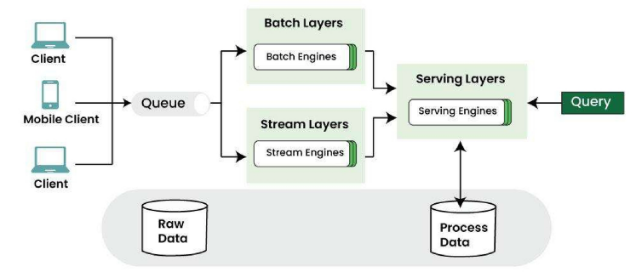
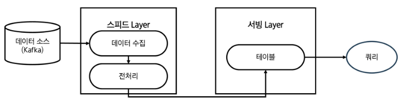

# 데이터 파이프라인
- 데이터를 추출하고, 정제하고 저장, 분석, 시각화하는 일련의 자동화 과정

# OLAP과 OLTP
### OLTP(Online Transaction Processing)
    - 운영 데이터 처리 시스템
    - 실시간 트랜잭션(주문, 결제, 예약 등) 처리
    - 행(Row) 단위 저장 구조
    - 빠른 입력, 수정, 삭제 최적화

### OLAP(Online Analytical Processing)
    - 분석 데이터 처리 시스템
    - OLTP에서 수집된 데이터를 기반으로 통계,리포트 분석
    - OLAP 시스템은 분석 성능을 위해 컬럼 기반 저장 구조를 사용하는 경우 많음
    - 집계, 요약, 예측 분석에 최적화

# ETL
- 데이터를 가공한 후 저장. 전통방식
- 추출(Extract) -> 가공(Transform) -> 저장(Load)

# 데이터 처리 방식
### 배치 처리 방식(Batch processing)
    - 데이터를 모아서 한 번에 처리
    - 주로 하루 1회, 시간 단위로 처리 
    - 정확성과 대량 처리 적합
### 스트리밍 처리 방식(Data Stream Processing)
    - 데이터가 들어오는 즉시 실시간 처리하는 방식
    - 빠르게 변화하는 데이터에 즉시 반응 가능
    - 실시간 분석과 대응 가능
### 정리
| 항목 | 배치 처리 | 스트리밍 처리 |
| :--- | :--- | :--- |
| **처리 방식** | 일정 주기로 대량 처리 | 실시간으로 지속 처리 |
| **예시** | 하루 1회 통계 리포트 | 실시간 사용자 클릭 분석 |
| **장점** | 안정적, 대규모 처리 적합 | 즉시 대응, 실시간 분석 가능 |
| **단점** | 지연 발생 가능 | 복잡한 설계 필요 |
    - 데이터의 속도,목표에 따라 적절한 방식을 선택해야함

# 데이터 파이프라인의 기본구조
- 자동화된 데이터 흐름
    - 데이터 소스 -> 수집 -> 가공 -> 저장 -> 분석/제공

# 데이터 저장소의 중요성
## 저장소는 분석을 위한 인프라
- 데이터를 단순히 저장하는 것이 아니라 분석,활용을 위한 설계가 필요
- 저장소에 따라 방식과 유연성이 달라짐
- 파이프라인에서 중요한 핵심 축

# 데이터 저장소의 종류
- **데이터 웨어하우스** : 정형 데이터를 저장하는 구조. 기본 저장구조
- **데이터 레이크** : 원본 데이터를 저장하는 구조. 수집 후 재가공하여 활용
- **데이터 마트** : 특정한 목적을 위해 데이터 웨어하우스의 내용을 다시 추출하여 저장

### 데이터 웨어하우스 구성
    - 정형 데이터 중심
    - 스키마 사전 정의
    - ETL 기반의 처리 방식

### 데이터 레이크의 구성
    - DW의 구조적 질서에 유연성을 결합
    - 분석, 모델링, BI 모두 대응하는 형태

##
| 구분 | 데이터 레이크 (Data Lake) | 데이터 웨어하우스 (Data Warehouse) |
| :--- | :--- | :--- |
| **주요 목적** | - 다양한 원천 데이터를 원형 그대로 저장<br>- 추후 분석·활용을 위한 유연한 데이터 저장소 | - 비즈니스 의사결정을 위한 정제된 데이터 저장소<br>- 리포팅과 분석 업무 최적화 |
| **데이터 형태** | - 정형, 반정형, 비정형 데이터 모두 수용 가능<br>- (예: 로그, 이미지, 오디오, JSON 등) | - 정형 데이터 위주(관계형 테이블 기반, 스키마 존재) |
| **사용 대상** | - 데이터 사이언티스트, 분석가, 기술적 역량이 있는 일반 사용자 | - 분석가, 관리자, 경영진 등 특정 목적 중심 사용자 |
| **데이터 적재 시점** | - 가공 없이 원본 데이터 그대로 저장<br>- 스키마 적용 없이 유연하게 수용 | - 사전 정의된 스키마에 맞게 가공 후 저장<br>- 데이터 품질, 정합성 확보 |
| **스키마 적용 시점** | - **Schema-on-Read**: 조회 시점에 스키마 적용<br>- 다양한 데이터 활용 가능 | - **Schema-on-Write**: 적재 시점에 스키마 적용<br>- 정형화된 구조 필수 |
| **데이터 적재 방식** | - **ELT**: 추출 → 적재 → 변환<br>- 대량 원본 수용 후 필요에 따라 처리 | - **ETL**: 추출 → 변환 → 적재<br>- 품질 정제 후 정해진 스키마에 맞춰 적재 |
| **데이터 품질 요구** | - 품질 보장보다 유연성과 포괄성 중시<br>- 노이즈 포함 가능성 존재 | - 정합성·신뢰성 중요<br>- 높은 품질 기준 충족 필요 |
| **비용 및 확장성** | - 상대적으로 저렴하고 확장성 높음<br>- (HDFS, S3 등 파일 기반 저장소 사용) | - 저장 비용이 상대적으로 높음<br>- (고가의 RDBMS, 분석 엔진 활용) |
| **분석 방식** | - 머신러닝, AI, 통계 분석 등 고급 분석에 활용<br>- 탐색적 분석 중심 | - 표준화된 리포트 및 대시보드 중심<br>- 운영 보고서, 경영 분석 등 |
| **운영 및 거버넌스** | - 데이터 거버넌스 체계 수립 필요<br>- 메타데이터 관리 및 품질 통제 체계 중요 | - 엄격한 데이터 품질관리 체계<br>- 보안·접근 제어 체계 정비 |

### 데이터 레이크와 웨어하우스 차이
    - 데이터 웨어하우스는 최종 사용자가 보고싶은 관점별 데이터 구성을 위해 원천 DB로부터 데이터를 수집
    - 스키마 관리와 품질 관리를 통해 리포트를 제공하는 시스템
    - DW는 데이터 구조가 이미 결정되어 엄격한 스키마 관리가 필요하고 한 번 구축 시 변경이 어려움

# ETL과 ELT의 차이
| 항목 | ETL (전통 방식) | ELT (클라우드 중심) |
| :--- | :--- | :--- |
| **순서** | 추출 → 가공 → 저장 | 추출 → 저장 → 가공 |
| **환경** | 온프레미스 DW | 클라우드, 데이터 레이크 |
| **장점** | 정제된 데이터 보장 | 유연한 가공, 확장성 우수 |
| **단점** | 느림, 유연성 부족 | 처리 비용 증가 가능성 |

# 데이터 수집 도구
### Kafka
    - 분산 메시지 큐 시스템
    - 대용량 데이터를 빠르고 안정적으로 전달
    - 실시간 스트리밍 수집에 강점

# 데이터 처리(가공) 도구
### Spark
    - 대규모 배치 처리 프레임워크
    - ETL/머신러닝 통합 가능
    - DAG 기반 처리로 안정성과 확장성 확보
### Flink
    - 스트리밍 처리 전문 프레임워크
    - 이벤트 기반 실시간 분석에 최적화
    - 상태 기반 연산 및 복잡한 처리 가능

# 데이터 저장 도구
### RDBMS(PostgreSQL, Oracle 등)
    - 고급 기능을 지원하는 오픈소스 관계형 데이터베이스
    - 정형 데이터 저장에 적합
### Elasticsearch
    - 실시간 검색과 분석에 강력한 NoSQL DB
    - 로그, 텍스트 분석, 모니터링 등 다양한 사용처
### Hadoop(HDFS)
    - 대용량 비정형 데이터 저장용 HDFS 기반 저장소
    - 정형, 비정형 데이터 통합 저장 가능

# 데이터 모니터링 및 워크플로우 관리 도구
### Airflow
    - 워크플로우 스케줄러(DAG 기반)
    - 파이프라인의 각 단계를 자동화 및 모니터링
### Grafana
    - 실시간 시각화 대시보드
    - 다양한 데이터 소스와 연결 가능(Prometheus, Elasticsearch 등)
### Prometheus
    - 시계열 기반 모니터링 도구
    - 지표 수집, 알림, 시각화 연동 기능 제공

# 데이터 레이크 분석 도구
### BI(Business Intelligence) / OLAP(Online Analytical Processing)
    - 데이터를 시각적으로 분석하거나 리포트를 만들기 위한 도구
    - 엑셀의 Pivot 기능 또는 시각화 기능과 같은 기능을 좀 더 전문적으로 다루는 도구
    - 원래 데이터 웨어하우스의 등장과 함께 같이 쓰이는 도구였으나, 데이터 레이크도 연결 가능
    - 라이선스 비용이 높은 편

### 데이터 레이크하우스의 구성
    - 정형 + 비정형 데이터 모두 저장
    - 스키마는 나중에 적용
    - 대용량 로그/세션 데이터 수용 가능

# 아키텍처 설계
- 데이터 엔지니어 관점에서 데이터 아키텍처 주 관심사는 파이프라인 설계
- 데이터 수집부터 분석/시각화 환경까지 데이터를 견고하게 전달할 수 있는 아키텍처 설계를 목표로 함

# 파이프라인 설계
- 람다 아키텍처 & 카파 아키텍처
    - 실시간 수집이 필요한 경우 참조할 수 있는 아키텍처가 존재한다
    - 대표적으로 람다(lambda)아키텍처와 카파(Kappa)아키텍처가 존재


## 람다 아키텍처
- 2011년에 제시된 아키텍처
- 실시간 수집이 필요한 경우 배치 처리와 스트림 처리를 모두 이용 가능

### Serving Layer
    - 배치 Layer에 저장된 데이터를 빠르게 보여주기 위한 서비스 계층
    - 사용자가 쿼리할 수 있도록 함
    - 필요에 따라 스피드 Layer에 있는 데이터를 결합하기도 함

### 배치 Layer & 스트림 Layer
    - 배치 Layer에 저장된 데이터가 특정 기준 데이터라면 스피드 Layer에는 당일 데이터가 저장/정제하여 저장하는 공간
    - 배치 Layer에서 테이블 갱신이 완료되면 스트림 Layer는 그 이후 데이터부터 저장 및 정제
    - 람다 아키텍처는 컨셉만 제공

---------------

## 카파 아키텍처
    - 배치 Layer를 제거하되 배치 Layer에서 하던 일을 모두 스피트 Layer에서 수행하는 구조(전처리 후 필요한 테이블로 재구성)
    - 데이터 소스는 주로 메시지 큐를 의미
    - 메시지 큐에는 여러 솔루션이 존재하지만 Kafka를 개발한 Jay Kreps가 만든 카파 아키텍처에서 데이터 소스는 사실상 Kafka의 Cluster를 의미
    - 카파 아키텍처에서 대표적으로 데이터는 Kafka로 수집함
    - 그러나 일반적으로 배치 파이프라인도 많이 활용


# 람다 아키텍처나 카파 아키텍처만 가능한가?
- 구조화된 아키텍처는 참고를 위한 아키텍처일 뿐
- 아키텍처 수용 여부는 파이프라인마다 데이터의 활용 요건으로 결정
- 데이터 활용 요건을 분석 후 아키텍처를 따를지 어떤 데이터 뷰를 활용할 지 결정

<!-- ----------------------Spark----------------------------------------- -->
<br>
<br>

# 데이터 처리 필요성 증가
- 데이터 처리는 단일 서버로 이루어짐
- 데이터 증가하면 서버 성능을 높이는 방식(수직 확장, Sacle-up) 사용
- 단일 서버는 하드웨어의 물리적 한게로 무한정 성능을 높일 수 없음
- 디스크를 사용했었음
    - 메모리(RAM)보다 데이터 읽기/쓰기 속도가 느리기 때문에 처리 과정에서 속도 저하 현상 발생


# Spark의 기술 한계 극복
| | 문제점 | Spark의 접근 방식 |
| :--- | :--- | :--- |
| **Hadoop** | 느린 처리 속도, 반복 작업 비효율 | 메모리 기반 연산(In-memory) |
| **RDBMS** | 확장성 부족, 비정형 데이터 처리 어려움 | 분산 클러스터 기반, 유연한 스키마 |
| **특화 시스템** | 기능 분산, 통합 어려움 | 하나의 플랫폼에서 배치 + 실시간 + ML |
| **디스크 기반 처리** | 입출력 병목 | DAG 기반 최적화 실행, Lazy 평가 |

## Spark 사용 이유
    - 반복 연산에서 hadoop MapReduce보다 빠른 처리 성능
    - 메모리 기반의 데이터 처리로 빠른 속도
    - Hadoop과의 유연한 연동성
    - RDD의 계보(lineage)를 기반으로 장애 발생 시 연산을 자동으로 재실행하여 복구

## Spark 설계 철학
    - 속도
        - 메모리 기반 연산으로 디스크 I/O 최소화
        - DAG 기반 스케줄링으로 병렬 처리 최적화
        - Tungsten 엔진을 통한 코드 생성 최적화
    - 사용 편리성
        - 단일 PC와 클러스터 간 코드 차이가 최소화된 추상화 구조
        - RDD -> DataFrame -> Dataset의 계층적 API 제공
        - Scala, Python, Java, R 등 다중 언어 지원
    - 모듈성
        - SparkSQL, Streaming, MLlib, GraphX 등 다양한 워크로드를 하나의 엔진에서 처리
        - 별도의 시스템(Hive, Storm, Mahout 등) 통합 불필요
    - 확장성
        - 다양한 데이터 소스(HDFS, Cassandra, MongoDB, RDBMS, S3) 연동
        - 여러 파잇 포맷(csv, parquet)지원
        - 수많은 서드파티 패키지와 통합 가능
    
## Spark의 주요 컴포넌트
    - 모든 컴포넌트는 Spark Core 위에서 실행되며, 공통된 실행 엔진 및 스케줄러 공유
| 컴포넌트 | 설명 |
| :--- | :--- |
| **Spark Core** | 핵심 실행 플랫폼 |
| **Spark SQL** | 구조적 데이터 처리 및 SQL 기반 쿼리 실행 |
| **Spark Streaming** | 실시간 데이터 분석을 위한 스트리밍 처리 (마이크로 배치 방식) |
| **MLlib** | 머신러닝 알고리즘 라이브러리 (분류, 회귀, 군집 등) |
| **GraphX** | 그래프 기반 데이터 처리와 분석 지원 (PageRank 등) |

## Spark 활용 시 주의점
    - 엄밀한 실시간 처리 불가(Micro-batch 기반)
    - 작은 데이터 파일 처리의 비효율성
    - 자체 파일 관리 시스템 부재(HDFS, S3 등 사용)
    - 높은 메모리 비용

## 애플리케이션 구성 요소
    1. 클러스터 매니저(Cluster Manager)
    2. 드라이버(Driver)
    3. 실행기(Executor)
    4. 스파크 세션(Session)
    5. 잡(Job)
    6. 스테이지(Stage)
    7. 태스크(task)

## 1. 클러스터 매니저(Cluster Manager)
    - 애플리케이션의 리소스 관리
        - 드라이버가 요청한 실행기 프로세스 시작
        - 실행 중인 프로세스를 중지하거나 재시작
        - 실행자 프로세스가 사용할 수 있는 최대 CPU 코어 개수 제한
    - 종류
        - Standalone
        - Hadoop Yarn
        - Kubernetes

## 2. 드라이버(Driver)
    - 스파크 애플리케이션의 실행을 관장하고 모니터링
        - 클러스터 매니저에 메모리 및 CPU 리소스를 요청
        - 애플리케이션 로직을 스테이지와 태스크로 분할
        - 여러 실행자에 태스크를 전달
        - 태스크 실행 결과 수집
        - 1개의 스파크 애플리케이션에는 1개의 드라이버만 존재
        - 드라이버 프로세스가 어디에 있는지에 따라, 스파크에는 크게 두 가지 모드가 존재
            - 클러스터 모드 : 드라이버가 클러스터 내의 특정 노드에 존재
            - 클라이언트 모드 : 드라이버가 클러스터 외부에 존재

## 3. 실행기(Executor)
    - 드라이버로부터 전달받은 태스크를 실행하는 프로세스
        - 태스크들을 받아서 실행, 그 결과를 드라이버로 반환
        - 각 프로세스는 드라이버가 요청한 태스크들을 여러 태스크 슬롯(스레드)에서 병렬로 실행
        - JVM 프로세스

## 4. 스파크 세션(Spark Session)
    - 스파크 기능(DataFrame, SQL 등)을 사용하기 위한 진입점
        - Spark Core 기능들과 상호 작용할 수 있는 진입점 제공
        - API로 프로그래밍을 할 수 있게 해주는 객체
        - spark-shell에서 기본적으로 제공
        - 스파크 애플맄이션에서는 사용자가 SparkSession 객체를 생성해 사용해야 함

## 5. 잡(Job)
    - 사용자가 실행한 액션(collect(), count() 등)에 의해 생성되는 작업 단위
        - 스파크 액션(save(), callect() 등)에 대한 응답으로 생성되는 여러 태스크로 이루어진 병렬 연산

## 6. 스테이지(stage)
    - 잡(Job)을 셔플(데이터 이동) 기준으로 나눈 실행 단위
        - 스파크 각 잡은 스테이지라 불리는 서로 의존성을 가지는 다수의 태스크 모음으로 나뉨

## 7. 태스크(task)
    - 스테이지를 구성하는 실제 실행 단위
        - 스파크 각 잡별 실행기로 보내지는 작업 할당의 가장 기본적인 단위
        - 개별 task slot에 할당 되고, 데이터의 개별 파티션을 가지고 작업


## 스파크 연산
- **트랜스포메이션(Transformation)**, **액션(Action)** 으로 구별

# Transformation
    - 불변인 원본 데이터 수정 안함 -> 하나의 RDD나 Dataframe을 새로운 RDD나 Dataframe으로 변형
    - (input, ouput) 타입 : (RDD, RDD) , (DataFrame,DataFrame)인 연산
        - map(), filter(), flatMap(), select(), groupby(), orderby() 등
    - Narrow, Wide Transformation 존재

## Narrow transformation
    - input : 1개의 파티션
    - output : 1개의 파티션
    - 파티션 간의 데이터 교환이 발생 안함 ex : filter(), map(), coalece()

## Wide transformation
    - 연산 시 파티션끼리 데이터 교환 발생 ex : groupby(), orderby(), sortByKey(), reduceByKey()
    - 단, join의 경우 두 부모 RDD/Dataframe이 어떻게 파티셔닝 되어 있냐에 따라 narrow일 수도 wide일 수도 있음

# Action
    - 불변인 인풋에 대해, Side effect(부수 효과)를 포함하고, 아웃풋이 RDD 혹은 Dataframe이 아닌 연산
    - count() -> 아웃풋 : int
    - collect() -> 아웃풋 : array
    - save() -> 아웃풋 : void

# Lazy evaluation
    - 모든 transformation은 즉시 계산되지 않음
    - 게보(lineage)라 불리는 형태로 기록
    - transformation이 실제 계산되는 시점은 action이 실행되는 시점
    - action이 실행될 때, 그 전까지 기록된 모든 transformation들의 지연 연산이 수행됨
    - 장점 :
        - 스파크가 연산 쿼리를 분석하고, 어디를 최적화할지 파악하여, 실행 계획 최적화 가능(eager evaluation이라면, 즉시 연산이 수행되기 때문에 최적화 여지가 없음)
        - 장애에 대한 데이터 내구성을 제공
        - 장애 발생 시, 스파크는 기록된 lineage를 재실행 하는 것만으로 원래 상태를 재생성 할 수 있음

# RDD란?
- 대용량 데이터를 분산 처리하고 분석하기 위한 Spark의 기본 데이터 처리 단위
- Resilient (탄력적인)
- Distributed (분산된)
- Dataset (데이터셋)

## 탄력성(Resilient) & 불변성(Immutable)
- RDD는 한 번 생성되면 변경 안 됨
- 어떤 노드(서버)가 장애로 인해 중단되더라도, 데이터 복구 가능

## 타입의 안정성 보장
    - 어떠한 하나의 타입의 객체를 가질 수 있음
    - 데이터 타입을 컴파일 시전에 검사
    - 성능 최적화
    - 코드의 가독성과 유지보수성 향상
    - Pyspark를 쓸 때는 Python이 동적 타입 언어이기 때문에 타입 안정성이 적용되지는 않음

## 정형(Structured) & 비정형(Unstructured) 데이터
    - 비정형 데이터 : 고정된 포맷이 없는 텍스트 데이터 -> sc.textFile()을 이용해 RDD로 로딩 후 map, filter, flatMap 등으로 가공
    - 정형 데이터 : 컬럼이 있는 테이블 형태 데이터 -> DataFrame 또는 RDD.map()으로 가공

# 지연 평가(Lazy Evaluation)
- 중간 연산을 줄여 성능 최적화
- 실행 계획을 최적화하여 성능 향상
- 불필요한 연산 방지로 리소스 절약

# RDD 생성
## 기존의 메모리 데이터를 RDD로 변환하는 방법
    - Python의 리스트(list)나 Scala의 컬렉션(Collection)을 RDD로 변환 가능
    - 이 방법은 주로 테스트나 작은 데이터 셋을 다룰 때 사용
## 외부파일(텍스트,csv,json)에서 RDD를 생성하는 방법
    - 실무에서는 보통 파일이나 데이터베이스에서 데이터를 불러와야 함
    - sc.textFile("파일 경로"), spark.read.format("jdbc").option(...) 형태를 사용하여 외부 데이터를 RDD로 변환 할 수 있음

# Parallelize()
1. 기존 메모리 데이터를 Spark의 RDD로 변환하는 역할
2. parallelize()는 메모리에 있는 데이터를 Spark 클러스터로 보낼 때 사용 -> 데이터가 클 경우 비효율적일 수 있어 소규모 데이터분석에 주로 이용

# sc.textFile()
1. 외부 파일에서 데이터를 직접 읽어와 RDD로 변환하는 역할
- MAP -> RDD의 각 요소에 함수 f를 적용하여 새로운 RDD를 반환
- FLATMAP -> RDD의 모든 요소에 먼저 함수 f를 적용한 뒤, 그 결과를 평탄화(flatten)하여 새로운 RDD를 반환
- FILTER -> filter의 조건을 만족하는 요소들만 포함하는 새로운 RDD를 반환
- MAPPARTITIONS -> RDD의 각 파티션에 함수 f를 적용하여 새로운 RDD를 반환
- MAPPARTITIONS WITH INDEX -> 원래 파티션의 인덱스를 추적하면서, RDD의 각 파티션에 함수를 적용하여 새로운 RDD를 반환
- KEYBY -> 원래 RDD의 각 항목에 대해 하나의 쌍(pair)을 생성하여 Pair RDD를 만들고, 쌍의 key는 사용자 정의 함수에 의해 값으로 부터 계산
- GROUPBY -> 원래 RDD의 데이터를 그룹화하기 위해, 사용자 정의 함수의 출력값을 key로 하고 이 key에 해당하는 모든 항목들을 value로 가지는 쌍(pair)을 생성
- GROUPBYKEY -> 원래 RDD에서 각 key에 해당하는 value들을 그룹화하고 그룹화된 value들을 모아, 원래의 key와 함께 새로운 쌍(pair)을 생성

# REDUCEBYKEY vs GROUPBYKEY
- 두 함수가 모두 사용 가능하다면, ReduceByKey를 사용
- ReduceByKey는 셔플 전에 행을 결합하여 셔플해야 할 행의 수를 줄일 수 있음

# JOIN
- 원래 RDD들에서 같은 키를 가진 모든 요소 쌍(pair)을 포함하는 새로운 RDD를 반환

# UNION
- 두 개의 원래 RDD에서 모든 항목을 포함하는 새로운 RDD를 반환. 중복된 항목은 제거 X

# DISTINCT
- 원래 RDD에서 중복을 제거한 고유한 항목들만 포함하는 새로운 RDD를 반환

# SAMPLE
- 원래 RDD에서 통계적 샘플을 추출하여 구성한 새로운 RDD를 반환

# 파티셔닝 재분배 (Repartition VS Coalesce)
- 파티션 수 늘리기 or 균등 재분배
    - repartition
- 파티션 수 줄이기 (shuffling 없음)
    - coalesce

# COALESCE
- 파티션 수를 줄여서 구성한 새로운 RDD를 반환

# PARTITIONBY
- 사용자 정의 함수가 반환하는 파티션에 따라 원래 항목들을 배치하여, 지정한 개수의 파티션을 갖는 새로운 RDD를 반환

# ACTIONS
- 변환된 RDD 데이터를 메모리로 가져오거나, 저장하거나, 집계하는 연산

| 연산 | 설명 | 예제 | 결과 |
| :--- | :--- | :--- | :--- |
| **collect()** | 모든 데이터를 리스트로 반환 | `rdd.collect()` | `[1, 2, 3, 4]` |
| **count()** | 전체 요소의 개수 반환 | `rdd.count()` | `4` |
| **reduce()** | 전체 요소를 하나로 결합 | `rdd.reduce(lambda a, b: a + b)` | `10` |
| **sum()** | 요소의 합 반환 | `rdd.sum()` | `10` |
| **mean()** | 평균 값 반환 | `rdd.mean()` | `2.5` |

# COLLECT
- RDD의 모든 항목을 하나의 리스트로 드라이버 프로그램으로 반환

# COUNTBYKEY
- RDD에 있는 각 키의 등장 횟수를 세어 키와 그 개수로 이루어진 맵(map)을 반환

# REDUCE
- RDD의 모든 요소를 사용자 정의 함수를 이용해 요소와 중간 결과를 쌍(pairwise)으로 연속적으로 집계하여, 최종 결과를 드라이버 프로그램으로 반환

# SUM
- RDD에 있는 모든 항목의 합(sum)을 반환

# MEAN
- RDD에 있는 모든 항목의 평균(mean)을 반환

<!-- -----------------Spark SQL 과 DataFrame 소개 ----------------------------------------- -->
<br>
<br>

# Dataframe API - 데이터 타입
- 기본 타입
    - Byte, Short,Integer, Long, Float, Double, String, Boolean, Decimal
- 정형화 타입
    - Binary, Timestamp, Date, Array, Map, Struct, StructField
- 실제 데이터를 위한 스키마를 정의할 때 어떻게 이런 타입들이 연계되는지를 아는 것이 중요

# Dataframe API - 스키마(Schema)
- 스파크에서의 스키마는 Dataframe을 위해 컬럼 이름과 연관된 데이터 타입을 정의한 것
- 외부 데이터 소스에서 구조화된 데이터를 읽어 들일 때 사용
    ## - 읽을 때 스키마를 가져오는 방식과 달리, 미리 스키마를 정의하는 것은 여러 장점 존재
        - 스카프가 데이터 타입을 추측해야 하는 책임을 덜어줌
        - 스파크가 스키마를 확정하기 위해, 파일의 많은 부분을 읽어 들이려 별도의 Job을 만드는 것을 방지
        - 데이터가 스키마와 맞지 않는 경우, 조기에 문제 발견 가능

# Dataframe = RDD + schema + DSL

# RDD와 DataFrame의 차이점은 무엇 ?

| 구분 | RDD | DataFrame |
| :--- | :--- | :--- |
| **데이터 표현 방식** | 값만 표현 가능, 스키마 표현 불가능 | 명확한 스키마(컬럼, 데이터 타입)를 가진 구조적 데이터 |
| **최적화 및 성능** | 최적화가 어려움, 직접적 연산 필요 | Catalyst Optimizer를 통한 자동 최적화 및 빠른 처리 가능 |
| **사용 편의성** | 낮음(저수준 API) | 높음(고수준 API, SQL 활용 가능) |
- DataFrame을 사용하면 데이터를 더욱 효율적이고 편리하게 처리 할 수 있으며, 데이터의 메타 정보를 활용하여 더 빠르고 최적화된 분석을 수행 가능


## RDD를 사용하는 경우
    1. 저수준의 Transformation과 Action을 직접 제어해야 할 때
    2. 스트림 데이터(미디어나, 텍스트 스트림)가 구조화되지 않은 경우
    3. 특정 도메인 표현을 위해 함수형 프로그래밍이 필요할 때
    4. 스키마 변환이 필요 없을 때 (예시 : 열 기반 저장소를 사용하지 않는 경우)
    5. DataFrame이나 Dataset에서 처리할 수 없는 성능 최적화가 필요할 때

## DataFrame을 사용하는 경우
    1. 고수준의 추상화와 도메인 기반 API가 필요할 때
    2. 고수준의 표현(filter, map, agg, avg, sum SQL, columnar access)등 복잡한 연산이 필요하거나 반구조적 데이터에 대한 lambda 식이 필요할 때
    3. 타입 안정성과 최적화를 위해 컴파일 시 타입 안정성을 보장함
    4. Catalyst 최적화 및 Tungsten의 효율적인 코드 제너레이션이 필요할 때
    5. Spark API의 일관성과 간결함을 원할 때

# Spark SQL ?
- 구조화된 데이터를 SQL처럼 처리할 수 있도록 해주는 스파크 모듈
- 내부적으로는 DataFrame/Dataset API와 동일한 엔진(catalyst)을 사용하여 처리
- DataFrame과 Dataset을 SQL처럼 다룰 수 있게 해주는 분산 SQL 쿼리 엔진
- Spark SQL은 RDD보다 더 높은 수준의 추상화와 자동 최적화를 제공
-> DataFrame이 중심, Spark SQL은 그것을 SQL방식으로 접근하게 해주는 방법 중 하나

## Spark SQL 역할
    - SQL 같은 질의 수행
    - 스파크 컴포넌트들을 통합하고, DataFrame, Dataset가 여러 프로그래밍 언어로 정형화 데이터 관련 작업을 단순화 할 수 있도록 추상화
    - 정형화 된 파일 포맷(JSON, CSV, txt등)에서 스키마와 정형화 데이터를 읽고 쓰며, 데이터를 임시 테이블로 변환
    - 빠른 데이터 탐색을 할 수 있도록 대화형 스파크 SQL 셸을 제공
    - 표준 데이터베이스 JDBC/ODBC 커넥터를 통해, 외부의 도구들과 연결할 수 있는 중간 역할 제공
    - 최종 실행을 위해 최적화 된 질의 계획과 JVM을 위한 최적화 된 코드를 생성

## Spark SQL의 내부 동작
    - SQL 쿼리를 실행하는 역할 + 사용자가 입력한 쿼리나 DataFrame의 명령을 가장 빠르고 효율적인 방식으로 처리
    - Spark SQL이 내부에서 데이터를 효율적으로 처리하는 핵심적인 엔진이 Catalyst Optimizer

### Spark SQL의 내부는 어떻게 작동 ?
- 최적화 과정
    1. SQL Parser & DataFrame API 해석 관계
    2. Logical Plan(논리적 계획) 생성
    3. Optimized Logical Plan (최적화된 논리 계획) 생성
    4. Physical Plan (물리적 실행 계획) 생성
    -> Catalyst Optimizer가 내부적으로 복잡환 최적화 과정을 자동으로 처리

# Spark SQL과 DataFrame API의 관계
- Spark SQL과 DataFrame API는 서로 완전히 독립된 별개의 것이 아님
- 동일한 최적화 엔진(Catalyst Optimizer)을 공유하고, 내부적으로 통합된 구조를 가짐
-> Spark에서는 DataFrame API를 이용해 작성된 데이터 처리 명령을 내부적으로 Spark SQL의 엔진으로 최적화해 실행

# Dataset API
- 스파크 2.0에서, 개발자들이 한 종류의 API만 알면 되도록, Dataframe, Dataset API를 하나로 합침
- Dataset은 정적 타입(typed) API와 동적 타입(untyped) API의 두 특성을 모두 가짐
- Java, Scala(타입 안전을 보장하는 언어)에서만 사용이 가능하고, Python, R(타입 안전을 보장하지 않는 언어)에서는 사용이 불가능, DataFrame API만 사용 가능

# View 등록 및 SQL 실행
- DataFrame을 뷰로 등록하기
   - ```df.createTempView("viewName")```
   - ```df.createGlobalTempView("viewName")```
   - ```df.createOrREplaceTempView(viewName")```
- 뷰에 SQL 쿼리 실행하기
    - ```spark.sql("SELECT * FROM viewName").show()```
    - ```spark.sql("SELECT * FROM temp.viewName").show()```

# DataFrame 구조 변환
- DataFrame -> RDD(분산 처리용 RDD로 변환)
    - ```rdd1 = df.rdd```
- DataFrame -> JSON문잦열 -> 첫번째 항목 확인
    - ```df.toJSON().first()```
- DataFrame -> Pandas DataFrame
    - ```pnadas_df = df.toPandas()```
    - ```print(pandas_df)```

# SQL 쿼리 기본 문법
- 데이터 조회 : SELECT, WHERE
- 정렬 : ORDER BY
- 중복 제거 : DISTINCT
- 데이터 집계 : GROUP BY, HAVING, 집계 함수(COUNT, AVG, SUM)
- 데이터 결합 : JOIN

# Creating DataFrames(DSL 코드)
```python
# SparkSession 생성
spark = SparkSession.builder.appName("ExampleApp").getOrCreate()

# 스미카 정의
schema = StructTyp([
    StructField("name", StringType(), True),
    StructField("age", IntegerType(), True)
])

# 데이터 전처리 및 DataFrame 생성
parts = spark.sparkContext.parallelize([("Mine","28"),("Filip","29"),("Jonathan","30")])
people = parts.map(lambda p: Row(name=p[0], age=int(p[1].strip())))
df = spark.createDataFrame(people, schema)

# 결과 출력
df.show()
```

# Creating DataFrames(SQL 코드)
```python
# DataFrame을 SQL에서 사용할 수 있도록 TempView 등록
df.createOrReplaceTempView("people")

# Spark SQL을 이용한 동일 조회
result = spark.sql("""
    SELECT name,age
    FROM people
""")

result.show()
```

# Creating DataFrames From File(DSL 코드)
```python
# DataFrame을 직접 생성
people_df = spark.read.option("header","false")
            .option("inferSchema","true")
            .csv("people.txt")
            .toDF("name", "age")

# 결과 출력
people_df.show()
```

# Creating DataFrames From File(SQL 코드)
```python
# DataFrame을 직접 생성
people_df = spark.read.option("header","false")
            .option("inferSchema","true")
            .csv("people.txt")
            .toDF("name", "age")

# TempView 등록
people_df.createOrReplaceTempView("people")

# SQL 쿼리로 조회
result = spark.sql("""SELECT name,age FROM people""")

# 출력 확인
result.show()
```

# From Spark Data Sources
```python
# JSON
df = spark.read.json(filename.json)
df = spark.read.load("filename.josn", format="json")

# Parquet files
df = spark.read.load("filename.arquet")

# TXT files
df = spark.read.txt("filename.txt")
```

```python
# 열 이름과 데이터 유형 반환
df.dtypes

# 내용 표시
df.show()

# 처음 n개의 행 반환
df.head()

# 첫번째 행 반환
df.first():
```

# Inspect Data
```python
# 처음 n개의 행 반환
df.take(n)

# DataFrame의 스키마 반환
df.schema

# 요약 통계 계산
df.describe().show()

# 열 이름 반환
df.columns

# 행 개수 계산
df.count()

# 고유 행 개수 계산
df.distinct().count()

# 스키마 출력
df.printSchema()

# (논리 및 물리적) 실행 계획 출력
df.explain()
```

# Duplicate Values
```python
# 중복 행 제거
df = df.dropDuplicates()
```

# 이후부터는 교안 Spark DataFrame과 Spark SQL_0130 38페이지부터 읽기 or gitlab 확인